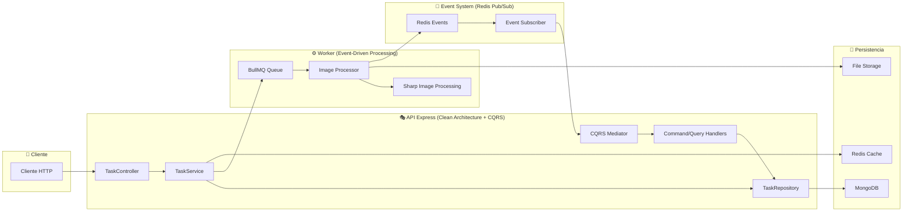

# 🖼️ Sistema de Procesamiento de Imágenes - Monorepo Empresarial

Este repositorio contiene un **sistema completo de procesamiento de imágenes de nivel empresarial**, diseñado con una arquitectura de microservicios desacoplados que implementa patrones modernos como Clean Architecture, CQRS y Event-Driven Architecture. El proyecto está compuesto por una **API REST principal** y un **worker de procesamiento** en segundo plano, coordinados a través de un sistema de colas y eventos para garantizar alta disponibilidad, escalabilidad y robustez.

## 📚 Documentación Técnica Detallada

Para un análisis técnico en profundidad de la arquitectura, flujos, esquemas de datos, estrategias de testing y resultados de las pruebas realizadas, consulte la **[Documentación Técnica Completa](image-express-api/docs/README.md)**, ubicada dentro del proyecto `image-express-api`.

### 📖 Índice de Documentación Técnica

| Documento | Descripción | Estado |
|-----------|-------------|--------|
| [`ARCHITECTURE.md`](image-express-api/docs/ARCHITECTURE.md) | Arquitectura híbrida del sistema | ✅ Completa |
| [`TESTING_DOCUMENTATION.md`](image-express-api/docs/TESTING_DOCUMENTATION.md) | **Documentación completa de pruebas realizadas** | ✅ Detallada |
| [`EVENTS_FLOW.md`](image-express-api/docs/EVENTS_FLOW.md) | Sistema de eventos asíncronos | ✅ Completa |
| [`PRESENTATION_APPLICATION_LAYERS.md`](image-express-api/docs/PRESENTATION_APPLICATION_LAYERS.md) | Capas Presentation y Application | ✅ Completa |
| [`DATABASE.md`](image-express-api/docs/DATABASE.md) | Esquemas y entidades MongoDB | ✅ Completa |
| [`QUEUE_CACHE.md`](image-express-api/docs/QUEUE_CACHE.md) | BullMQ y Redis Cache | ✅ Completa |

## 🏗️ Arquitectura General

El sistema implementa una **arquitectura híbrida empresarial** que combina patrones para lograr máxima eficiencia y escalabilidad:

1. **Patrón Service Layer (Flujo Síncrono)**: La `image-express-api` maneja las peticiones HTTP con respuestas inmediatas
2. **Patrón CQRS + Event-Driven (Flujo Asíncrono)**: El `image-processing-worker` procesa imágenes y notifica eventos
3. **Clean Architecture**: Separación estricta de responsabilidades en capas



## 📁 Estructura del Proyecto

### Monorepo Organizado por Servicios

```text
jmrg-et-kairos-api/
├── image-express-api/           # 🎯 API REST Principal
│   ├── src/
│   │   ├── application/         # 🏗️ Clean Architecture - Application Layer
│   │   │   ├── core/           # ⚙️ CQRS Core (CommandBus, QueryBus, Mediator)
│   │   │   ├── handlers/       # 🎯 Command & Query Handlers
│   │   │   ├── commands/       # 📝 Commands (CreateTask, UpdateTaskStatus)
│   │   │   ├── queries/        # 🔍 Queries (GetTask, ListTasks)
│   │   │   └── services/       # 🔧 Application Services
│   │   ├── domain/             # 🎯 Domain Layer
│   │   │   ├── entities/       # 📊 Business Entities
│   │   │   └── dtos/          # 📋 Data Transfer Objects
│   │   ├── infrastructure/     # 🔧 Infrastructure Layer
│   │   │   ├── queues/        # 🔄 BullMQ Implementation
│   │   │   ├── cache/         # ⚡ Redis Cache
│   │   │   └── databases/     # 💾 MongoDB Implementation
│   │   └── presentation/      # 🌐 Presentation Layer
│   │       ├── controllers/   # 🎮 HTTP Controllers
│   │       └── middlewares/   # 🛡️ Express Middlewares
│   ├── tests/                 # 🧪 Testing Suite
│   │   ├── unit/             # ⚗️ Unit Tests (22 suites)
│   │   ├── integration/      # 🔗 Integration Tests
│   │   └── fixtures/         # 📁 Test Data & Assets
│   └── docs/                 # 📚 Technical Documentation
├── image-processing-worker/    # ⚙️ Worker de Procesamiento
│   ├── src/
│   │   ├── processors/       # 🖼️ Image Processing Logic
│   │   ├── events/          # 📡 Event Publishers
│   │   └── infrastructure/  # 🔧 Worker Infrastructure
│   └── tests/               # 🧪 Worker Tests
├── docker-compose.yml        # 🐳 Stack de Desarrollo Completo
├── config/                   # ⚙️ Configuraciones
│   ├── prometheus/          # 📊 Monitoring Config
│   ├── grafana/            # 📈 Dashboard Config
│   └── loki/               # 📝 Logging Config
└── scripts/                 # 🛠️ Scripts de Utilidad
```

## 🚀 Inicio Rápido (Docker Compose)

### Stack Completo de Desarrollo

El método recomendado es usar Docker Compose para levantar todo el entorno empresarial:

```bash
# 1. Clonar el repositorio
git clone https://github.com/tu_usuario/jmrg-et-kairos-api.git
cd jmrg-et-kairos-api

# 2. Configurar variables de entorno
cp .env.example .env
# Editar .env con configuraciones específicas del entorno

# 3. Levantar stack completo (desarrollo)
docker-compose up --build -d

# 4. Verificar servicios
docker-compose ps
```

### 🌐 **Servicios Iniciados y Puertos**

| Servicio | Puerto | Descripción | Estado |
|----------|--------|-------------|--------|
| `api-backend` | 3000 | API REST principal | ✅ Production Ready |
| `worker` | - | Procesador de imágenes | ✅ Production Ready |
| `mongodb` | 27099 | Base de datos principal | ✅ Optimizada |
| `redis` | 6379 | Cache & Queue storage | ✅ Optimizada |
| `traefik` | 80/443 | Proxy & Load Balancer | ✅ SSL Ready |
| `prometheus` | 9090 | Métricas del sistema | ✅ Configurado |
| `grafana` | 3001 | Dashboard de monitoreo | ✅ Dashboards incluidos |
| `loki` | 3100 | Agregación de logs | ✅ Centralizado |

### ✅ Verificación del Sistema

```bash
# Health check de la API
curl http://localhost:3000/api/v1/health

# Documentación interactiva
open http://localhost:3000/api-docs

# Dashboard de monitoreo
open http://localhost:3001  # Grafana

# Métricas del sistema
open http://localhost:9090  # Prometheus
```

## 🧪 Testing

### 🔬 **Test Suites Disponibles**

```bash
# Ejecutar suite completa de tests
cd image-express-api
npm install
npm run test:coverage

# Tests específicos por área
npm test -- unit/application/core/      # Core CQRS
npm test -- unit/application/handlers/  # Command/Query Handlers  
npm test -- unit/infrastructure/        # Infrastructure Layer
npm test -- integration/               # Integration Tests
```

### 🎯 **Componentes con 100% Coverage**

| Componente | Coverage | Tests | Estado |
|------------|----------|-------|--------|
| **CommandBus** | 100% | 15 tests | ✅ Completo |
| **QueryBus** | 100% | 18 tests | ✅ Completo |
| **Mediator** | 100% | 12 tests | ✅ Completo |
| **CreateTaskCommandHandler** | 100% | 11 tests | ✅ Completo |
| **UpdateTaskStatusCommandHandler** | 100% | 11 tests | ✅ Completo |
| **GetTaskQueryHandler** | 100% | 14 tests | ✅ Completo |
| **ListTasksQueryHandler** | 100% | 14 tests | ✅ Completo |
| **TaskEvents (Redis Pub/Sub)** | 100% | 25 tests | ✅ Completo |
| **CacheService** | 100% | 28 tests | ✅ Completo |
| **TaskQueueProducer (BullMQ)** | 100% | 31 tests | ✅ Completo |

## 💡 Decisiones Clave de Diseño

### 🏗️ **Architectural Patterns**

- ✅ **Arquitectura Híbrida**: Service Layer + CQRS optimizada para diferentes flujos
- ✅ **Clean Architecture**: Separación estricta de responsabilidades en capas
- ✅ **Event-Driven**: Sistema robusto de eventos con Redis Pub/Sub
- ✅ **CQRS**: Command/Query separation optimizada para escalabilidad

### 🔧 **Technical Decisions**

- ✅ **BullMQ v5.58.2**: Sistema de colas enterprise-grade
- ✅ **Redis Cache**: Patrón Cache-Aside con invalidación inteligente
- ✅ **MongoDB**: Esquemas optimizados con índices de performance

### 🚀 **Scalability & Performance**

- ✅ **Horizontal Scaling**: Worker processes independientes
- ✅ **Cache Strategy**: TTL optimizado y invalidación por patrones
- ✅ **Queue Processing**: Concurrencia configurable y retry logic
- ✅ **Monitoring**: Stack completo Prometheus + Grafana + Loki

## 🛡️ Calidad y Robustez

### 📋 **Quality Features**

- **Error Handling**: Chain of Responsibility pattern
- **Logging**: Structured logging con Loki
- **Monitoring**: Métricas completas con Prometheus
- **Security**: HTTPS, Rate limiting, CORS configurado
- **Performance**: Cache strategy optimizada
- **Scalability**: Microservices desacoplados

## Documentación

- **Documentación Técnica**: [`image-express-api/docs/`](image-express-api/docs/)
- **Testing Documentation**: [`TESTING_DOCUMENTATION.md`](image-express-api/docs/TESTING_DOCUMENTATION.md)
- **API Documentation**: `http://localhost:3000/api-docs` (Swagger UI)
- **Architecture Overview**: [`ARCHITECTURE.md`](image-express-api/docs/ARCHITECTURE.md)

---

*Este proyecto demuestra la implementación exitosa de patrones arquitectónicos modernos con validación completa mediante testing comprehensivo.*
