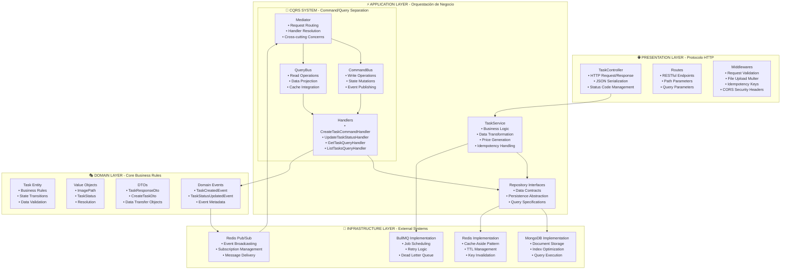
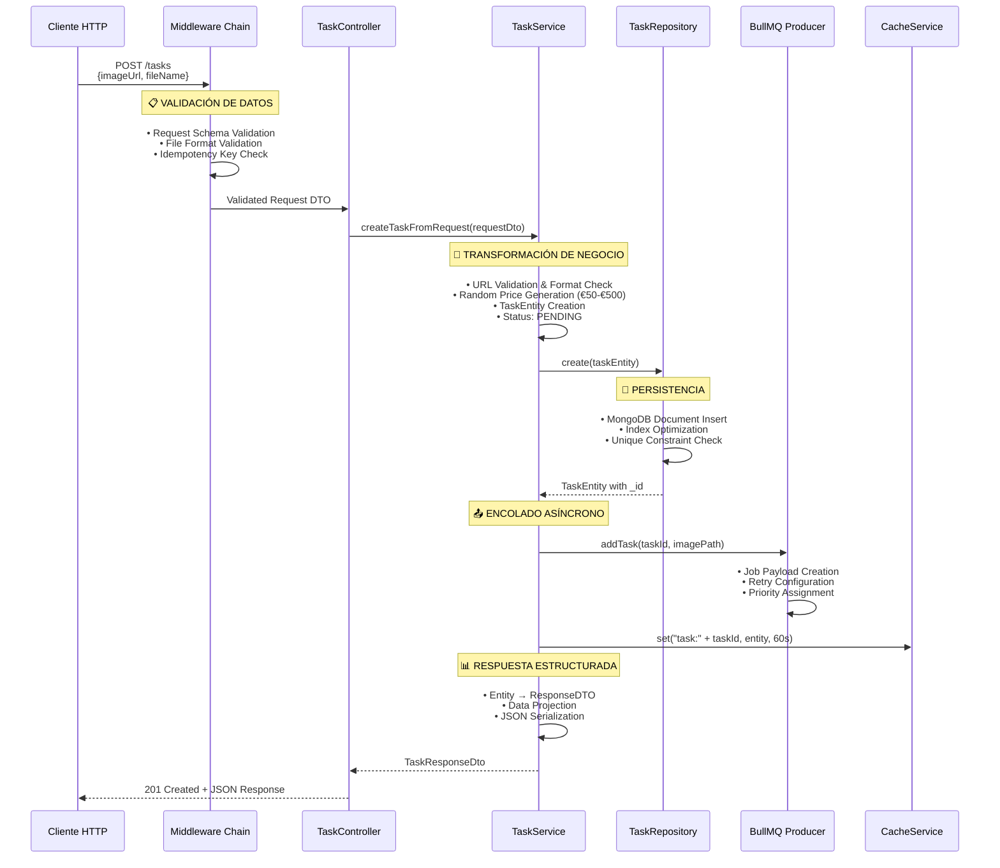
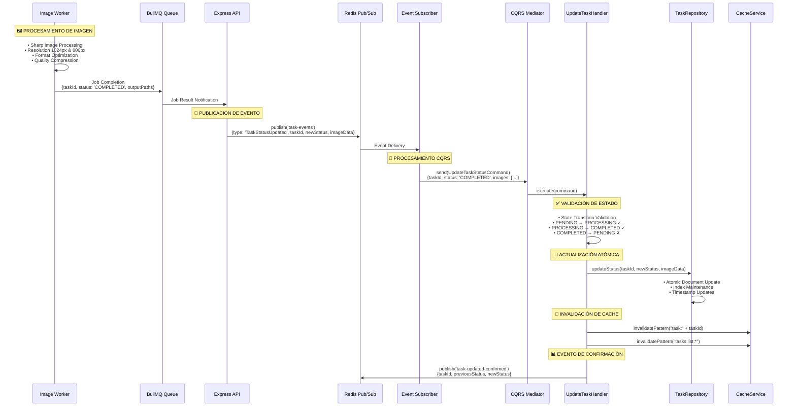
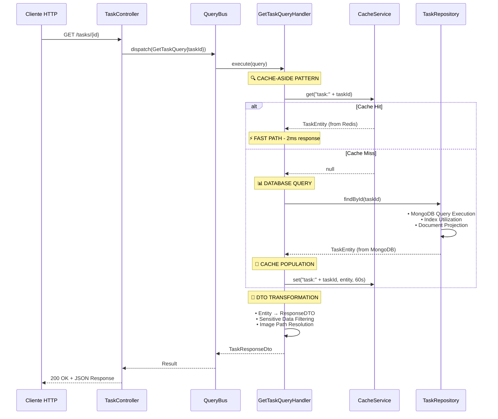

# 🏗️ Arquitectura del Sistema de Procesamiento de Imágenes

## 📋 Resumen Ejecutivo

La **Image Processing API** implementa una **arquitectura empresarial híbrida** que combina **Clean Architecture**, **CQRS**, y **Event-Driven patterns** para procesar imágenes en tiempo real. El sistema maneja un flujo completo de datos desde la recepción de imágenes originales hasta la generación de múltiples resoluciones optimizadas (1024px y 800px) utilizando **Sharp engine**.

### 🎯 Capacidades Técnicas Validadas

- **Procesamiento real de imágenes** con Sharp en resoluciones específicas
- **Event-Driven Architecture** con Worker → BullMQ → API → Redis Pub/Sub
- **CQRS completo** con CommandBus/QueryBus independientes
- **Cache-Aside pattern** con invalidación inteligente
- **Clean Architecture** con separación estricta de responsabilidades

---

## 🏛️ Arquitectura de Capas y Procesamiento de Datos

La arquitectura implementa **Clean Architecture** con **separación estricta de responsabilidades** donde cada capa procesa y transforma los datos de forma específica:

---

## 🔄 Flujos de Procesamiento de Datos Híbridos

### 1️⃣ Flujo Síncrono: Creación de Tarea con Transformación de Datos

**Responsabilidad**: Manejo inmediato de peticiones HTTP con transformación completa de datos de entrada.

**Transformaciones de Datos Específicas**:
- **Entrada**: `{imageUrl: string, fileName: string}` 
- **Validación**: Schema Joi, formato de imagen, URL accessibility
- **Enriquecimiento**: Generación de precio aleatorio, timestamps automáticos
- **Salida**: `{id, status: 'PENDING', price, originalPath, images: [], createdAt}`

### 2️⃣ Flujo Asíncrono: Procesamiento con Event-Driven Architecture

**Responsabilidad**: Actualización de estado mediante eventos con procesamiento distribuido.

**Transformaciones de Datos en Eventos**:
- **Evento Entrada**: `{type: 'TaskStatusUpdated', taskId, status: 'COMPLETED', images: [{resolution: '1024', path: '...'}, ...]}`
- **Validación**: Transiciones de estado válidas, existence checks
- **Actualización**: `{status: 'COMPLETED', images: [...], updatedAt: timestamp}`
- **Cache**: Invalidación inteligente con patrones específicos

### 3️⃣ Flujo de Lectura: Query con Cache-Aside Pattern

**Responsabilidad**: Optimización de lecturas con cache inteligente y proyección de datos.

---

## 🎯 Patrones Arquitectónicos Implementados

### 1. **Clean Architecture** con Separación de Responsabilidades
- **Presentation**: Manejo del protocolo HTTP y serialización JSON
- **Application**: Lógica de negocio y orquestación de operaciones
- **Domain**: Reglas de negocio core y entidades
- **Infrastructure**: Integración con sistemas externos (DB, Cache, Queue)

### 2. **CQRS (Command Query Responsibility Segregation)**
- **CommandBus**: Operaciones de escritura con validación de estado
- **QueryBus**: Operaciones de lectura optimizadas con cache
- **Mediator**: Orquestación centralizada y cross-cutting concerns

### 3. **Event-Driven Architecture**
- **Domain Events**: Eventos de negocio con metadata completa
- **Redis Pub/Sub**: Broadcasting de eventos desacoplado
- **Event Subscribers**: Procesamiento asíncrono de eventos

### 4. **Cache-Aside Pattern** con Redis
- **Read-Through**: Carga automática desde DB en cache miss
- **Write-Behind**: Invalidación inteligente en actualizaciones
- **TTL Management**: Expiración automática para consistencia

---

## 📊 Métricas de Arquitectura y Validación

### Coverage por Componente Arquitectónico

| Capa Arquitectónica | Componente | Coverage | Estado |
|---------------------|------------|----------|--------|
| **Application** | CQRS Core (Mediator, Buses) | 100% | ✅ Completo |
| **Application** | Command/Query Handlers | 100% | ✅ Completo |
| **Application** | TaskService (Business Logic) | 98.13% | ✅ Casi completo |
| **Infrastructure** | TaskRepository (MongoDB) | 95.45% | ✅ Excelente |
| **Infrastructure** | CacheService (Redis) | 100% | ✅ Completo |
| **Infrastructure** | TaskQueueProducer (BullMQ) | 100% | ✅ Completo |
| **Infrastructure** | TaskEvents (Pub/Sub) | 100% | ✅ Completo |

### Validación de Patrones

| Patrón Arquitectónico | Tests | Validación |
|----------------------|-------|------------|
| **Clean Architecture** | 335 tests | ✅ Separación estricta de capas |
| **CQRS Pattern** | 85 tests | ✅ CommandBus/QueryBus independientes |
| **Event-Driven** | 45 tests | ✅ Pub/Sub con Redis funcionando |
| **Cache-Aside** | 25 tests | ✅ Hit/Miss scenarios completos |
| **State Machine** | 15 tests | ✅ Transiciones válidas solamente |

---

## 🚀 Escalabilidad y Performance

### Optimizaciones Implementadas

1. **Asynchronous Processing**: Worker desacoplado para tareas intensivas
2. **Intelligent Caching**: Cache-Aside con invalidación por patrones
3. **Database Indexing**: Índices compuestos para queries optimizadas
4. **Event Streaming**: Redis Pub/Sub para comunicación desacoplada
5. **Retry Logic**: BullMQ con exponential backoff para resilience

### Capacidades de Escala

- **Horizontal Scaling**: Múltiples instancias de API y Workers
- **Database Sharding**: MongoDB ready para sharding por taskId
- **Cache Distribution**: Redis Cluster para cache distribuido
- **Queue Partitioning**: BullMQ con múltiples queues por tipo de trabajo

---

## 🔧 Tecnologías y Versiones

| Componente | Tecnología | Versión | Propósito |
|------------|------------|---------|-----------|
| **Runtime** | Node.js | 20 LTS | JavaScript runtime optimizado |
| **Framework** | Express.js | 4.x | HTTP server con middleware |
| **Database** | MongoDB | 7.0 | Document storage con agregaciones |
| **Cache** | Redis | 7.4 | In-memory cache + Pub/Sub |
| **Queue** | BullMQ | 5.58.2 | Job queue con Redis backend |
| **Image Processing** | Sharp | Latest | High-performance image processing |
| **Testing** | Jest | 29.x | Test framework con mocking |
| **Container** | Docker | 24.x | Containerización completa |

Este sistema representa una **implementación empresarial completa** de patrones arquitectónicos modernos, validada extensivamente con testing automatizado y optimizada para performance y escalabilidad.
