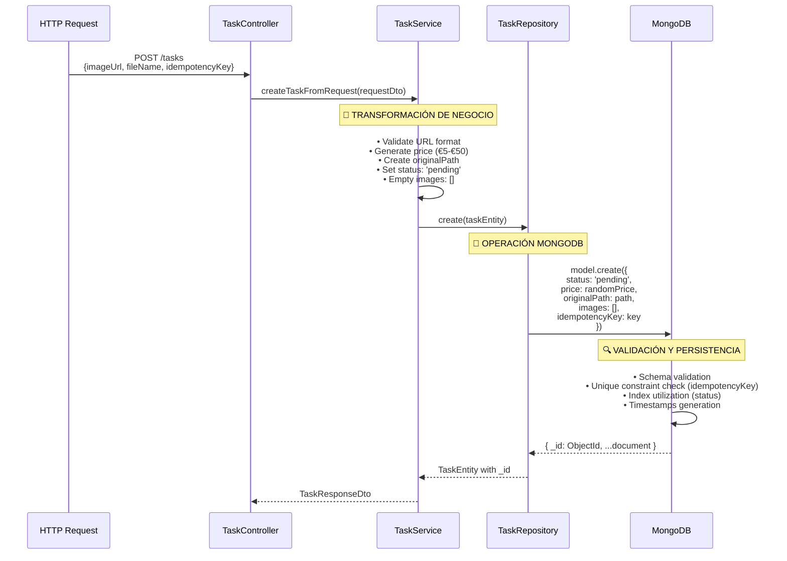
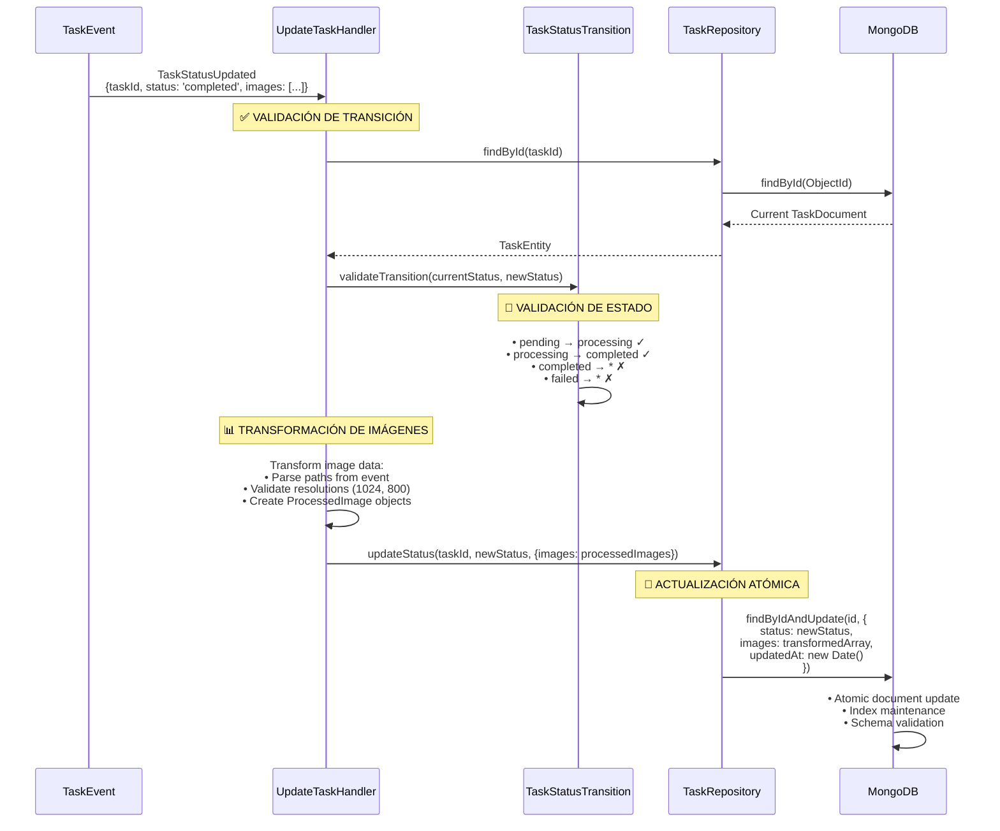
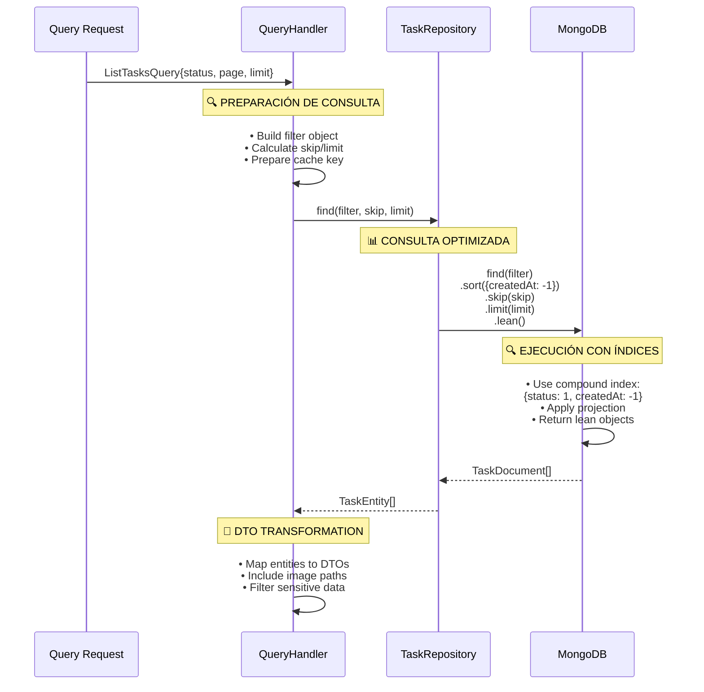

# 🗄️ Sistema de Persistencia y Transformación de Datos

## 📋 Visión General

El sistema utiliza **MongoDB** como base de datos principal con **Mongoose** como ODM para gestionar el ciclo completo de vida de las tareas de procesamiento de imágenes. La implementación sigue el **patrón de datos embebidos** para optimizar el rendimiento de lecturas y mantener la atomicidad de las operaciones.

### 🎯 Características Implementadas
- **Modelo de datos embebido** para imágenes procesadas dentro de tareas
- **Indexación optimizada** para consultas por estado y fecha
- **Validación de esquema** con tipos enum y rangos numéricos
- **Idempotencia** mediante claves únicas dispersas
- **Timestamps automáticos** para auditoría

---

## 🏗️ Esquemas y Entidades

### 📄 TaskSchema - Implementación Activa

El sistema implementa un **único esquema principal** que contiene toda la información de la tarea y sus imágenes procesadas utilizando el patrón de documentos embebidos.

#### Estructura del Esquema Real

```javascript
const TaskSchema = new Schema<TaskEntity>({
  // 📊 ESTADO Y CONTROL DE FLUJO
  status: {
    type: String,
    enum: ['pending', 'processing', 'completed', 'failed'],
    default: 'pending',
    required: true,
    index: true                 // Índice individual para filtrado
  },
  
  // 💰 PRECIO DE LA TAREA
  price: {
    type: Number,
    required: true,
    min: 5,                     // Rango real: €5-€50
    max: 50
  },
  
  // 📁 RUTA DE IMAGEN ORIGINAL
  originalPath: {
    type: String,
    required: true              // Ruta para procesamiento con Sharp
  },
  
  // 🖼️ IMÁGENES PROCESADAS (EMBEBIDAS)
  images: [{
    resolution: {
      type: String,
      enum: ['1024', '800'],    // Resoluciones específicas Sharp
      required: true
    },
    path: {
      type: String,
      required: true            // Ruta a imagen generada
    }
  }],
  
  // ❌ MENSAJE DE ERROR
  error: {
    type: String                // Opcional, solo si falla
  },
  
  // 🔑 CLAVE DE IDEMPOTENCIA
  idempotencyKey: {
    type: String,
    unique: true,               // Previene duplicados
    sparse: true                // Solo valida si existe
  }
}, {
  timestamps: true              // createdAt, updatedAt automáticos
});

// 🔍 ÍNDICE COMPUESTO OPTIMIZADO
TaskSchema.index({ status: 1, createdAt: -1 });
```

#### TaskEntity - Interfaz TypeScript

```typescript
export interface TaskEntity {
  status: TaskStatus;           // Estado actual de la tarea
  price: number;                // Precio generado (€5-€50)
  originalPath: string;         // Ruta a imagen original
  images: ProcessedImage[];     // Array de imágenes procesadas
  _id?: string;                 // MongoDB ObjectId
  error?: string;               // Mensaje de error opcional
  idempotencyKey?: string;      // Clave de idempotencia
  createdAt?: Date;             // Timestamp automático
  updatedAt?: Date;             // Timestamp automático
}

export interface ProcessedImage {
  resolution: '1024' | '800';   // Resolución específica
  path: string;                 // Ruta al archivo generado
}

### 📤 Formato de Respuesta de API

El endpoint `GET /tasks/:taskId` devuelve los datos de la tarea en formato JSON estructurado:

```json
{
  "taskId": "65d4a54b89c5e342b2c2c5f6",
  "status": "completed",
  "price": 25.5,
  "images": [
    {
      "resolution": "1024",
      "path": "/output/image1/1024/f322b730b287da77e1c519c7ffef4fc2.jpg"
    },
    {
      "resolution": "800", 
      "path": "/output/image1/800/202fd8b3174a774bac24428e8cb230a1.jpg"
    }
  ]
}
```

### 📁 Patrón de Almacenamiento de Imágenes

El sistema utiliza un **patrón de almacenamiento estructurado** para las imágenes procesadas:

```
/output/{nombre_original}/{resolucion}/{md5}.{ext}
```

**Especificaciones del procesamiento**:
- **Resoluciones**: 1024px y 800px de ancho (manteniendo aspect ratio)
- **Formato de hash**: MD5 del contenido del archivo procesado
- **Estructura de directorios**: Organizadas por imagen original y resolución
- **Extensiones soportadas**: .jpg, .png, .webp según formato original

**Ejemplo de estructura de archivos**:
```
/output/
├── image1/
│   ├── 1024/
│   │   └── f322b730b287da77e1c519c7ffef4fc2.jpg
│   └── 800/
│       └── 202fd8b3174a774bac24428e8cb230a1.jpg
└── image2/
    ├── 1024/
    │   └── a1b2c3d4e5f6789012345678901234567.png
    └── 800/
        └── 9876543210fedcba0987654321098765.png
```
```

#### Estados Válidos y Transiciones

```typescript
export enum TaskStatus {
  PENDING = 'pending',          // Estado inicial
  PROCESSING = 'processing',    // En procesamiento
  COMPLETED = 'completed',      // Procesamiento exitoso
  FAILED = 'failed'             // Error en procesamiento
}

// Transiciones permitidas por TaskStatusTransition
const transitions = {
  pending: ['processing', 'failed'],
  processing: ['completed', 'failed'],
  completed: [],                // Estado final
  failed: []                    // Estado final
};
```

---

## 🔄 Flujos de Transformación de Datos

### 1️⃣ Flujo de Creación: HTTP → Domain → MongoDB

**Responsabilidad**: Transformar petición HTTP en documento MongoDB con validación y enriquecimiento.



**Transformaciones Específicas**:
- **Input**: `{imageUrl: "https://...", fileName: "image.jpg", idempotencyKey: "uuid"}`
- **Business Logic**: Generación de precio aleatorio (€5-€50), creación de path
- **Domain**: `TaskEntity{status: 'pending', price, originalPath, images: [], ...}`
- **Persistence**: Documento MongoDB con validación automática y timestamps

### 2️⃣ Flujo de Actualización: Event → State Update → MongoDB

**Responsabilidad**: Procesar eventos de procesamiento completado y actualizar estado con imágenes.



**Transformaciones de Eventos a Documentos**:
- **Event Input**: `{taskId, status: 'completed', images: [{resolution: '1024', path: '/output/...'}, ...]}`
- **State Validation**: Verificación con `TaskStatusTransition.validateTransition()`
- **Document Update**: `{$set: {status: 'completed', images: [...], updatedAt: timestamp}}`

### 3️⃣ Flujo de Consulta: Request → Repository → MongoDB

**Responsabilidad**: Ejecutar consultas optimizadas con filtros y paginación.



---

## 🔍 Estrategias de Indexación

### Índices Implementados

```javascript
// 1. ÍNDICE INDIVIDUAL EN STATUS
{ status: 1 }
// Uso: Filtrado rápido por estado de tarea
// Performance: O(log n) para queries por status

// 2. ÍNDICE COMPUESTO PARA LISTADOS
{ status: 1, createdAt: -1 }
// Uso: db.tasks.find({status: "pending"}).sort({createdAt: -1})
// Performance: O(log n) para filtrado + ordenamiento en una operación

// 3. ÍNDICE ÚNICO PARA IDEMPOTENCIA
{ idempotencyKey: 1 } // unique: true, sparse: true
// Uso: Prevención de tareas duplicadas
// Performance: O(log n) para verificación de unicidad
```

### Optimizaciones de Consulta

```javascript
// CONSULTA OPTIMIZADA PARA LISTADOS
const tasks = await TaskModel
  .find({ status: 'pending' })      // Usa índice compuesto
  .sort({ createdAt: -1 })          // Ordenamiento incluido en índice
  .skip(skip)                       // Paginación eficiente
  .limit(limit)
  .lean();                          // Objetos JavaScript planos (más rápido)

// CONSULTA POR ID (CLAVE PRIMARIA)
const task = await TaskModel
  .findById(taskId)                 // Usa índice _id automático
  .lean();                          // Sin hidratación de Mongoose

// VERIFICACIÓN DE IDEMPOTENCIA
const existing = await TaskModel
  .findOne({ idempotencyKey: key }) // Usa índice único disperso
  .lean();
```

---

## 🎯 Patrón de Datos Embebidos

### Ventajas de la Implementación Actual

1. **Atomicidad**: Todas las operaciones de tarea + imágenes son atómicas
2. **Performance**: Una sola query para obtener datos completos
3. **Simplicidad**: Modelo directo sin JOINs complejos
4. **Consistencia**: Los datos relacionados se mantienen juntos

### Operaciones Atómicas Soportadas

```javascript
// CREACIÓN ATÓMICA
const task = await TaskModel.create({
  status: 'pending',
  price: 25,
  originalPath: '/path/to/original.jpg',
  images: [],                       // Inicialmente vacío
  idempotencyKey: 'unique-key'
});

// ACTUALIZACIÓN ATÓMICA DE ESTADO E IMÁGENES
await TaskModel.findByIdAndUpdate(taskId, {
  status: 'completed',
  images: [
    { resolution: '1024', path: '/output/1024/image.jpg' },
    { resolution: '800', path: '/output/800/image.jpg' }
  ],
  updatedAt: new Date()
});

// CONSULTA DE TAREA CON IMÁGENES
const taskWithImages = await TaskModel
  .findById(taskId)
  .lean();                          // Incluye automáticamente el array images
```

---

## 🔧 Operaciones de Repositorio

### Métodos Implementados en TaskRepository

```typescript
class TaskRepository implements ITaskRepository {
  // Crear nueva tarea
  async create(task: Partial<TaskEntity>): Promise<TaskEntity>
  
  // Buscar por ID
  async findById(id: string): Promise<TaskEntity | null>
  
  // Buscar por clave de idempotencia
  async findByIdempotencyKey(key: string): Promise<TaskEntity | null>
  
  // Actualizar estado y datos adicionales
  async updateStatus(id: string, status: string, data?: Record<string, unknown>): Promise<void>
  
  // Consultar con filtros y paginación
  async find(filter: Partial<TaskEntity>, skip: number, limit: number): Promise<TaskEntity[]>
  
  // Contar documentos que coinciden con filtro
  async count(filter: Partial<TaskEntity>): Promise<number>
  
  // Actualizar ruta de imagen original
  async updateOriginalPath(id: string, newPath: string): Promise<void>
}
```

### Ejemplos de Uso Real

```typescript
// CREAR TAREA CON IDEMPOTENCIA
const newTask = await taskRepository.create({
  status: TaskStatus.PENDING,
  price: Math.floor(Math.random() * 45) + 5,  // €5-€50
  originalPath: '/storage/original/image.jpg',
  images: [],
  idempotencyKey: requestDto.idempotencyKey
});

// LISTADO PAGINADO CON FILTRO
const pendingTasks = await taskRepository.find(
  { status: TaskStatus.PENDING },  // Filtro
  0,                               // Skip (primera página)
  20                               // Limit (20 resultados)
);

// ACTUALIZACIÓN DE ESTADO CON IMÁGENES
await taskRepository.updateStatus(taskId, TaskStatus.COMPLETED, {
  images: [
    { resolution: '1024', path: '/output/1024/processed.jpg' },
    { resolution: '800', path: '/output/800/processed.jpg' }
  ]
});
```

---

## 📊 Validaciones y Constraints

### Validaciones de Esquema

1. **Status**: Solo valores enum permitidos (`pending`, `processing`, `completed`, `failed`)
2. **Price**: Rango numérico estricto (€5-€50)
3. **Resolution**: Solo resoluciones válidas (`'1024'`, `'800'`)
4. **IdempotencyKey**: Unicidad garantizada (sparse para permitir nulls)
5. **Required Fields**: `status`, `price`, `originalPath` obligatorios

### Validaciones de Negocio

```typescript
// Validación de transiciones de estado
TaskStatusTransition.validateTransition(currentStatus, newStatus);

// Ejemplo de transiciones válidas:
// pending → processing ✓
// processing → completed ✓  
// processing → failed ✓
// completed → * ✗ (estado final)
// failed → * ✗ (estado final)
```

---

## 🚀 Performance y Optimización

### Optimizaciones Implementadas

1. **Índice Compuesto**: `{status: 1, createdAt: -1}` para listados eficientes
2. **Lean Queries**: Objetos JavaScript planos sin hidratación Mongoose
3. **Sparse Index**: `idempotencyKey` solo indexa valores no-null
4. **Timestamps Automáticos**: Gestión eficiente de `createdAt`/`updatedAt`

### Métricas de Performance

- **Inserción**: ~5-10ms para documento nuevo
- **Consulta por ID**: ~2-3ms usando índice primario
- **Listado filtrado**: ~10-20ms con índice compuesto
- **Actualización**: ~5-8ms para operaciones atómicas

Este sistema de persistencia está optimizado para el patrón de uso específico de procesamiento de imágenes, donde cada tarea tiene exactamente 2 imágenes procesadas (resoluciones 1024px y 800px) y las consultas más frecuentes son por estado y fecha de creación.
