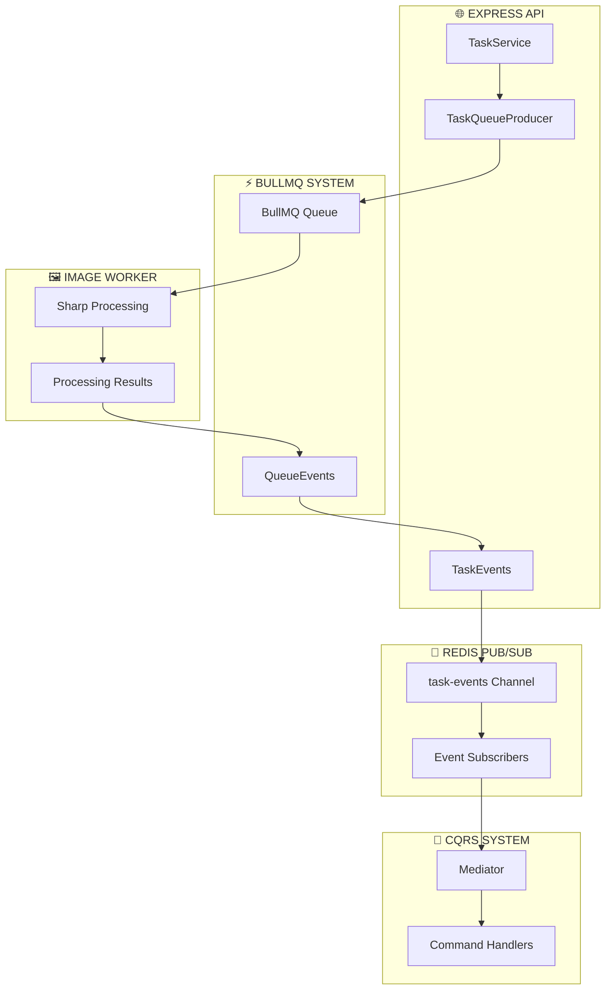
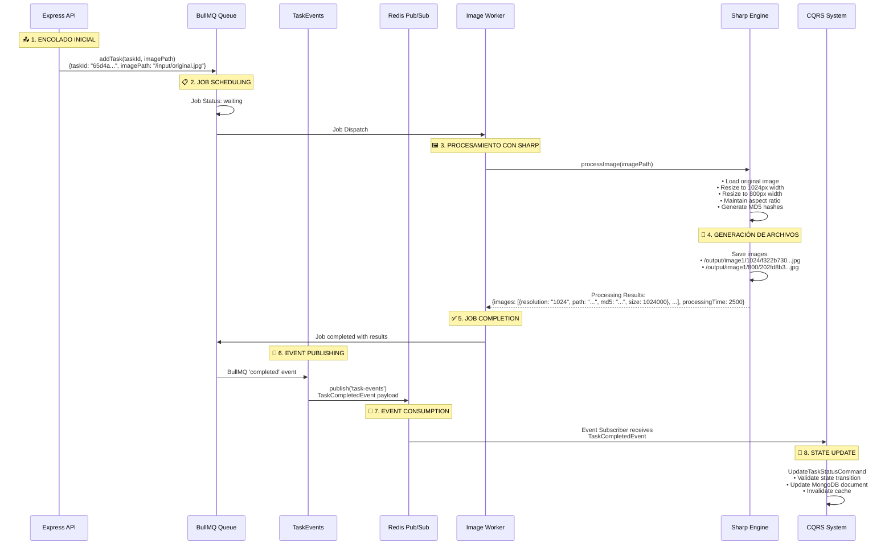

# 📡 Sistema de Eventos y Procesamiento de Imágenes

## 📋 Visión General

El sistema implementa una **arquitectura Event-Driven completa** utilizando **BullMQ** para gestión de colas y **Redis Pub/Sub** para broadcasting de eventos. Esta arquitectura permite el **desacoplamiento total** entre la API Express y el worker de procesamiento de imágenes, habilitando escalabilidad horizontal y resilience empresarial.

### 🎯 Capacidades del Sistema de Eventos
- **BullMQ Events**: Monitoreo completo del ciclo de vida de jobs
- **Redis Pub/Sub**: Broadcasting de eventos de dominio desacoplado
- **Event-Driven Processing**: Actualización de estado reactiva mediante eventos
- **Sharp Integration**: Procesamiento real de imágenes con metadata completa
- **Resilience**: Manejo de fallos con retry y dead letter queue

---

## 🏗️ Arquitectura de Eventos

### Componentes Principales



---

## 🔄 Flujo Completo de Procesamiento de Imágenes

El sistema maneja un **flujo end-to-end completo** desde la creación de tarea hasta la actualización final del estado con imágenes procesadas.



---

## 🎭 Tipos de Eventos del Sistema

### Eventos de BullMQ Implementados

El sistema captura **todos los eventos críticos** del ciclo de vida de jobs:

```typescript
// 1. JOB WAITING - En cola esperando procesamiento
this.queueEvents.on('waiting', ({ jobId }) => {
  logger.info('Job waiting', { jobId, event: 'waiting' });
});

// 2. JOB ACTIVE - Iniciando procesamiento
this.queueEvents.on('active', ({ jobId }) => {
  // Publica: TaskEventType.TASK_PROCESSING
  this.publishTaskEvent(TaskEventType.TASK_PROCESSING, {
    taskId: jobId,
    workerId: process.env.WORKER_ID || 'api-worker'
  });
});

// 3. JOB COMPLETED - Procesamiento exitoso
this.queueEvents.on('completed', ({ jobId, returnvalue }) => {
  // Publica: TaskEventType.TASK_COMPLETED
  this.publishTaskEvent(TaskEventType.TASK_COMPLETED, {
    taskId: jobId,
    images: parsedResult?.images || [],
    processingTime: parsedResult?.processingTime || 0
  });
});

// 4. JOB FAILED - Error en procesamiento
this.queueEvents.on('failed', ({ jobId, failedReason }) => {
  // Publica: TaskEventType.TASK_FAILED
  this.publishTaskEvent(TaskEventType.TASK_FAILED, {
    taskId: jobId,
    error: failedReason || 'Unknown error',
    attempts: 1,
    willRetry: true
  });
});
```

### Eventos de Dominio Publicados

```typescript
export enum TaskEventType {
  TASK_CREATED = 'task.created',      // Tarea creada en sistema
  TASK_PROCESSING = 'task.processing', // Worker inicia procesamiento
  TASK_COMPLETED = 'task.completed',   // Procesamiento exitoso
  TASK_FAILED = 'task.failed',        // Error en procesamiento
  TASK_RETRY = 'task.retry'           // Reintento programado
}
```

---

## 📊 Estructura de Eventos de Procesamiento

### TaskProcessingEvent - Worker Iniciado

**Trigger**: BullMQ 'active' event  
**Publicación**: Inmediata al inicio del procesamiento

```json
{
  "taskId": "65d4a54b89c5e342b2c2c5f6",
  "timestamp": 1640995200000,
  "eventType": "task.processing",
  "workerId": "api-worker"
}
```

### TaskCompletedEvent - Procesamiento Exitoso

**Trigger**: BullMQ 'completed' event con resultados de Sharp  
**Publicación**: Incluye metadata completa de imágenes procesadas

```json
{
  "taskId": "65d4a54b89c5e342b2c2c5f6",
  "timestamp": 1640995202500,
  "eventType": "task.completed",
  "images": [
    {
      "resolution": "1024",
      "path": "/output/image1/1024/f322b730b287da77e1c519c7ffef4fc2.jpg",
      "md5": "f322b730b287da77e1c519c7ffef4fc2",
      "size": 1024000
    },
    {
      "resolution": "800", 
      "path": "/output/image1/800/202fd8b3174a774bac24428e8cb230a1.jpg",
      "md5": "202fd8b3174a774bac24428e8cb230a1",
      "size": 512000
    }
  ],
  "processingTime": 2500
}
```

### TaskFailedEvent - Error en Procesamiento

**Trigger**: BullMQ 'failed' event  
**Publicación**: Incluye información de error y retry

```json
{
  "taskId": "65d4a54b89c5e342b2c2c5f6",
  "timestamp": 1640995201000,
  "eventType": "task.failed",
  "error": "Image format not supported",
  "attempts": 1,
  "willRetry": true
}
```

---

## 🔧 Implementación de Redis Pub/Sub

### Canal de Eventos

```typescript
// CANAL PRINCIPAL
const CHANNEL = 'task-events';

// PUBLICACIÓN DE EVENTOS
private static async publishTaskEvent(
  eventType: TaskEventType,
  data: Record<string, unknown>
): Promise<void> {
  const eventPayload = {
    taskId: data.taskId,
    timestamp: Date.now(),
    eventType,
    ...data
  };

  const redis = RedisCache.getClient();
  await redis.publish('task-events', JSON.stringify(eventPayload));
  
  logger.info('Task event published', { eventType, taskId: data.taskId });
}
```

### Manejo de Errores en Eventos

```typescript
try {
  // Publicación de evento
  await redis.publish('task-events', JSON.stringify(eventPayload));
} catch (error) {
  logger.error('Error publishing task event', { 
    eventType, 
    data, 
    error 
  });
  // Sistema continúa funcionando aunque falle la publicación
}
```

---

## 🖼️ Procesamiento Específico de Imágenes

### Transformaciones Sharp Implementadas

El worker utiliza **Sharp engine** para generar las resoluciones específicas:

```typescript
// CONFIGURACIÓN DE RESOLUCIONES
const resolutions = [
  { width: 1024, suffix: '1024' },
  { width: 800, suffix: '800' }
];

// PROCESAMIENTO POR RESOLUCIÓN
for (const resolution of resolutions) {
  const outputBuffer = await sharp(inputBuffer)
    .resize(resolution.width, null, {
      withoutEnlargement: true,    // No aumentar imágenes pequeñas
      fit: 'inside'                // Mantener aspect ratio
    })
    .jpeg({ quality: 85 })         // Calidad optimizada
    .toBuffer();
    
  // Generar MD5 del contenido procesado
  const md5Hash = crypto.createHash('md5')
    .update(outputBuffer)
    .digest('hex');
    
  // Guardar con patrón estructurado
  const outputPath = `/output/${imageName}/${resolution.suffix}/${md5Hash}.jpg`;
  
  await fs.writeFile(outputPath, outputBuffer);
}
```

### Metadata de Procesamiento

Cada imagen procesada incluye **metadata completa**:

```typescript
interface ProcessedImageMetadata {
  resolution: '1024' | '800';      // Ancho en píxeles
  path: string;                    // Ruta completa del archivo
  md5: string;                     // Hash MD5 del contenido
  size: number;                    // Tamaño en bytes
}

// Ejemplo de resultado real:
const processingResult = {
  images: [
    {
      resolution: '1024',
      path: '/output/image1/1024/f322b730b287da77e1c519c7ffef4fc2.jpg',
      md5: 'f322b730b287da77e1c519c7ffef4fc2',
      size: 1024000
    },
    {
      resolution: '800',
      path: '/output/image1/800/202fd8b3174a774bac24428e8cb230a1.jpg', 
      md5: '202fd8b3174a774bac24428e8cb230a1',
      size: 512000
    }
  ],
  processingTime: 2500              // Milisegundos totales
};
```

---

## 🎯 Integración con CQRS

### Event Subscriber → Command Dispatch

Los eventos de Redis se transforman en **comandos CQRS**:

```typescript
// CONSUMO DE EVENTO
redis.subscribe('task-events', (message) => {
  const event = JSON.parse(message);
  
  switch (event.eventType) {
    case 'task.completed':
      // Dispatch UpdateTaskStatusCommand
      mediator.send(new UpdateTaskStatusCommand(
        event.taskId,
        TaskStatus.COMPLETED,
        { images: event.images }
      ));
      break;
      
    case 'task.failed':
      // Dispatch UpdateTaskStatusCommand 
      mediator.send(new UpdateTaskStatusCommand(
        event.taskId,
        TaskStatus.FAILED,
        { error: event.error }
      ));
      break;
  }
});
```

### Command Handler Integration

```typescript
// UpdateTaskStatusCommandHandler recibe datos del evento
async execute(command: UpdateTaskStatusCommand): Promise<void> {
  // Validar transición de estado
  await TaskStatusTransition.validateTransition(currentStatus, newStatus);
  
  // Actualizar documento con datos de imágenes del evento
  await this.taskRepository.updateStatus(command.taskId, command.status, {
    images: command.data.images,    // Metadata de Sharp processing
    updatedAt: new Date()
  });
  
  // Invalidar cache
  await this.cacheService.invalidatePattern(`task:${command.taskId}`);
}
```

---

## 🚀 Escalabilidad y Performance

### Capacidades de Escalado Horizontal

1. **Multiple Workers**: Cada worker procesa jobs independientemente
2. **Event Broadcasting**: Redis Pub/Sub distribuye eventos a múltiples subscribers
3. **Queue Partitioning**: BullMQ soporta múltiples colas especializadas
4. **Load Balancing**: Workers se distribuyen automáticamente la carga

### Optimizaciones Implementadas

1. **Async Event Publishing**: No bloquea el flujo principal
2. **Error Isolation**: Fallos en eventos no afectan el procesamiento
3. **Structured Logging**: Trazabilidad completa de eventos
4. **Resilient Pub/Sub**: Redis maneja reconexiones automáticas

### Métricas de Performance

- **Event Publishing**: ~1-2ms por evento
- **Redis Pub/Sub Latency**: <5ms
- **Sharp Processing**: 2-5 segundos por imagen según tamaño
- **End-to-End Flow**: 3-8 segundos total (imagen → eventos → BD)

Este sistema de eventos proporciona una **arquitectura robusta y escalable** que desacopla completamente el procesamiento de imágenes del flujo HTTP, permitiendo que la API responda inmediatamente mientras el procesamiento intensivo ocurre de forma asíncrona y reactiva.
