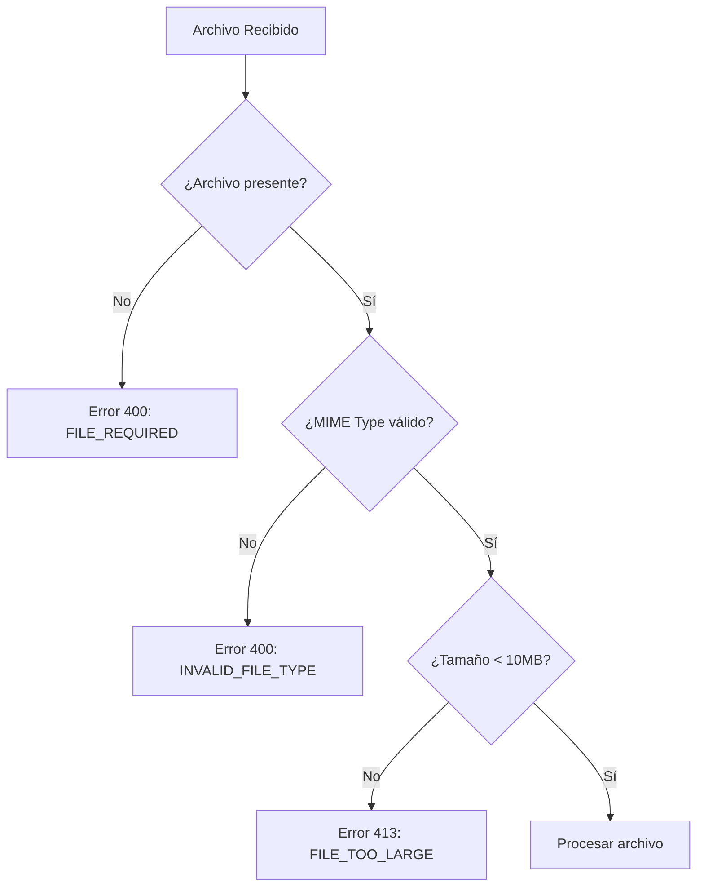
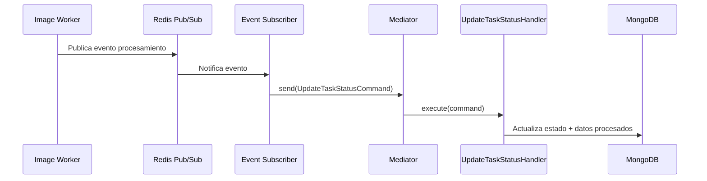

# 🎭 Capas Presentation + Application

## Descripción General

Las capas **Presentation** y **Application** implementan una arquitectura híbrida que maneja flujos de datos síncronos y asíncronos para el procesamiento de imágenes. El sistema procesa datos desde múltiples fuentes (uploads HTTP, URLs externas, rutas locales) y los transforma a través de capas bien definidas.

### Flujos de Datos Implementados

1. **Flujo Síncrono HTTP**: TaskController → TaskService → Repository/Queue
2. **Flujo Asíncrono CQRS**: Event Subscriber → Mediator → Command/Query Handlers
3. **Flujo de Depuración**: Endpoints administrativos para Redis/BullMQ

## 🌐 Presentation Layer (Capa de Presentación)

### Responsabilidades de Manejo de Datos

La capa de presentación implementa 14 operaciones específicas que procesan diferentes tipos de datos:

#### Operaciones de Gestión de Tareas
- **create**: Procesa peticiones con `imageUrl` o `imagePath`
- **createWithUpload**: Maneja uploads de archivos con validaciones MIME
- **getById**: Retorna datos de tarea específica con transformación DTO
- **list**: Implementa paginación con filtros de estado
- **retry**: Re-encola tareas fallidas

#### Operaciones de Monitoreo (Internas)
- **getQueueStats**: Extrae estadísticas de BullMQ
- **getQueueJobsByState**: Filtra trabajos por estado específico
- **deleteJobById**: Elimina trabajos de la cola
- **getRedisKeys**: Lista claves con patrones específicos
- **getRedisValue**: Obtiene valores individuales de Redis
- **getAllRedisKeys**: Análisis completo de estructuras BullMQ
- **getAllRedisEvents**: Extrae eventos de Redis Streams
- **deleteRedisAll**: Limpieza masiva con patrones
- **deleteRedisKey**: Eliminación específica de claves

### Procesamiento de Datos de Entrada

```typescript
// Validaciones implementadas en TaskController
class TaskController {
  private static readonly ALLOWED_MIME_TYPES = ['image/jpeg', 'image/png', 'image/webp'];
  private static readonly MAX_FILE_SIZE = 10 * 1024 * 1024; // 10MB
  private static readonly DEFAULT_PAGE = 1;
  private static readonly DEFAULT_LIMIT = 10;
  private static readonly MAX_JOBS_PER_REQUEST = 49;
}
```

### Transformación de Respuestas

El controller transforma datos a formato JSON estandarizado:

```json
{
  "taskId": "string",
  "status": "pending|processing|completed|failed", 
  "price": "number",
  "images": "ProcessedImage[] (solo si completed)",
  "error": "string (solo si failed)",
  "createdAt": "Date",
  "updatedAt": "Date"
}
```

### Flujo de Validación de Archivos



## ⚡ Application Layer (Capa de Aplicación)

### TaskService: Orquestación de Datos

El `TaskService` implementa lógica compleja de orquestación con tres fuentes de datos:

#### 1. Procesamiento desde Upload
```typescript
// Flujo real implementado
if (req.file) {
  source = 'upload';
  finalImagePath = req.file.path;
  // Log detallado con filename, size
}
```

#### 2. Descarga desde URL
```typescript
if (req.body.imageUrl) {
  source = 'url';
  finalImagePath = await this.imageDownloadService.download(req.body.imageUrl);
  // Log con downloadTime medido
}
```

#### 3. Imagen desde Ruta Local
```typescript
if (req.body.imagePath) {
  source = 'path';
  finalImagePath = req.body.imagePath;
  // Validación de existencia del archivo
}
```

### Gestión de Idempotencia

```typescript
// Sistema de idempotencia implementado
if (idempotencyKey) {
  const existing = await this.repository.findByIdempotencyKey(idempotencyKey);
  if (existing) {
    return this.mapEntityToDto(existing); // Retorna existente
  }
}
```

### Transformación de Entidades a DTOs

```typescript
private mapEntityToDto(task: TaskEntity): TaskResponseDto {
  const response: TaskResponseDto = {
    taskId: task._id!.toString(),
    status: task.status as 'pending' | 'processing' | 'completed' | 'failed',
    price: task.price,
  };

  // Agregado condicional de campos según estado
  if (task.status === TaskStatus.COMPLETED && task.images?.length > 0) {
    response.images = task.images;
  }
  
  if (task.status === TaskStatus.FAILED && task.error) {
    response.error = task.error;
  }
  
  return response;
}
```

### Logging Estructurado por Contexto

```typescript
interface LogContext {
  taskId?: string;
  idempotencyKey?: string;
  source?: 'upload' | 'url' | 'path';
  status?: TaskStatus;
  [key: string]: unknown;
}
```

El servicio registra información específica en cada etapa:
- **Inicio**: Fuente de datos y parámetros de entrada
- **Procesamiento**: Tiempo de descarga, rutas de archivos
- **Finalización**: TaskID generado, tiempo total de procesamiento
- **Errores**: Contexto completo para debugging

### Manejo de Archivos y Directorios

```typescript
// Flujo de movimiento de archivos implementado
const baseImagesDir = path.join(rootPath, 'storage', 'images');
const taskDir = path.join(baseImagesDir, task.taskId);
await fs.mkdir(taskDir, { recursive: true });

const dest = path.join(taskDir, `original${path.extname(finalImagePath)}`);
await fs.rename(finalImagePath, dest);
await this.repository.updateOriginalPath(task.taskId, dest);
```

### Integración con Sistema de Colas

```typescript
// Encolado tras mover archivo a ubicación definitiva
await this.queue.addTask(task.taskId, dest);
```

## 🔄 Sistema CQRS para Flujo Asíncrono

### Separación de Responsabilidades

- **Commands**: `CreateTaskCommand`, `UpdateTaskStatusCommand` - Modifican estado
- **Queries**: `GetTaskQuery`, `ListTasksQuery` - Solo lectura de datos
- **Handlers**: Procesan commands/queries específicos con validaciones
- **Mediator**: Enruta operaciones al handler correspondiente

### Validaciones de Transiciones de Estado

```typescript
// TaskStatusTransition implementa validaciones estrictas
TaskStatusTransition.validateTransition(task.status, newStatus);
```

Estados válidos:
- `PENDING` → `PROCESSING` (inicio de procesamiento)
- `PROCESSING` → `COMPLETED` (éxito con imágenes)
- `PROCESSING` → `FAILED` (error con mensaje)
- `FAILED` → `PENDING` (retry manual)

### Flujo de Actualización Asíncrona



## 📊 Gestión de Paginación y Filtros

### Implementación de Paginación

```typescript
// Cálculo de offset y límites
const skip = (options.page - 1) * options.limit;
const filter: Partial<TaskEntity> = {};

if (options.status) {
  filter.status = options.status;
}

// Ejecución paralela para optimización
const [tasks, total] = await Promise.all([
  this.repository.find(filter, skip, options.limit),
  this.repository.count(filter),
]);
```

### Respuesta de Lista Paginada

```json
{
  "data": "TaskResponseDto[]",
  "pagination": {
    "page": "number",
    "limit": "number", 
    "total": "number",
    "totalPages": "number"
  }
}
```

## 🛠️ Operaciones de Depuración

### Análisis de Estado de BullMQ

```typescript
// Obtención de estadísticas completas
const counts = await queue.getJobCounts(
  'waiting', 'active', 'completed', 'failed', 'delayed', 'paused'
);
```

### Inspección de Redis

- **Keys por patrón**: Búsqueda flexible con wildcards
- **Valores tipados**: Manejo de hash, list, set, zset, string
- **Streams de eventos**: Análisis de mensajes Redis Streams
- **Limpieza selectiva**: Eliminación por patrones específicos

Este diseño permite respuesta inmediata al cliente HTTP mientras el procesamiento complejo se ejecuta de forma asíncrona, garantizando escalabilidad y robustez en el manejo de grandes volúmenes de imágenes.
