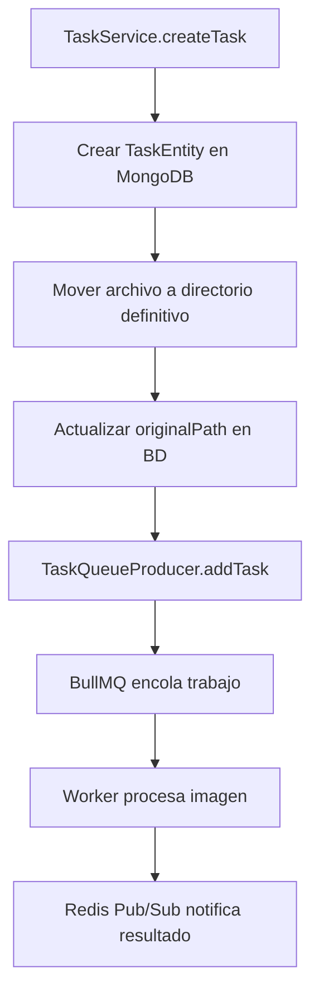

# ⚡ Sistema de Cola (BullMQ) y Caché (Redis)

## Descripción General

Redis actúa como infraestructura central que soporta dos subsistemas críticos del procesamiento de imágenes: el **sistema de cola asíncrona** para el procesamiento pesado y el **sistema de caché** para optimización de consultas. Ambos sistemas utilizan la misma instancia Redis pero están claramente separados por responsabilidades.

## 🔄 Sistema de Cola con BullMQ v5.58.2

### Configuración y Arquitectura

El sistema implementa una cola robusta para desacoplar el procesamiento de imágenes del ciclo de respuesta HTTP:

```typescript
// Configuración real implementada en TaskQueueProducer
class TaskQueueProducer {
  private static queue: Queue;
  
  private static initializeQueue(): void {
    this.queue = new Queue(envs.QUEUE.NAME, {
      connection: RedisConnection.getConfig(),
    });
  }
}
```

### Estructura del Payload de Trabajos

Cada trabajo encolado contiene metadatos específicos para el procesamiento:

```json
{
  "taskId": "65d4a54b89c5e342b2c2c5f6",
  "imagePath": "/storage/images/TASK_ID/original.jpg",
  "timestamp": 1640995200000
}
```

**Campos críticos:**
- `taskId`: ID de MongoDB para asociación con TaskEntity
- `imagePath`: Ruta absoluta al archivo original procesable
- `timestamp`: Marca temporal para métricas y debugging

### Configuración de Trabajos y Recuperación

```typescript
// Configuración real de resilencia implementada
await TaskQueueProducer.queue.add('process-image', payload, {
  attempts: envs.QUEUE.MAX_RETRIES,
  backoff: {
    type: 'exponential',
    delay: 2000,
  },
  removeOnComplete: true,
  removeOnFail: false,
});
```

**Estrategias de resilencia:**
- **Reintentos**: Configurables via `envs.QUEUE.MAX_RETRIES`
- **Backoff exponencial**: Base de 2000ms, crecimiento exponencial
- **Autolimpieza**: Trabajos exitosos se eliminan automáticamente
- **Preservación de fallos**: Trabajos fallidos se mantienen para análisis

### Flujo de Encolado Implementado



## 💾 Sistema de Caché Cache-Aside

### Arquitectura del CacheService

```typescript
// Implementación del patrón Cache-Aside
class CacheService {
  async getOrSet<T>(key: string, fn: () => Promise<T>, ttl: number = 60): Promise<T> {
    const cached = await this.cache.get(key);
    if (cached) {
      return JSON.parse(cached) as T;
    }
    
    const value = await fn();
    await this.cache.set(key, JSON.stringify(value), ttl);
    return value;
  }
}
```

### Configuración Redis Real

```typescript
// Configuración de conexión implementada
static async initialize(): Promise<void> {
  this.client = new Redis({
    host: envs.REDIS.HOST,
    port: envs.REDIS.PORT,
    password: envs.REDIS.PASSWORD,
    db: envs.REDIS.DB,
    retryStrategy: times => Math.min(times * 50, 2000),
  });
}
```

**Características de conexión:**
- **Reintentos**: Estrategia adaptativa con máximo 2000ms
- **Monitoreo**: Logs específicos para connect/error events
- **Configuración**: Variables de entorno para flexibilidad

## 🗂️ Estrategias de Caching por Handler

### GetTaskQueryHandler

```typescript
// TTL específico implementado
private static readonly TTL = 60; // 60 segundos

async execute(query: GetTaskQuery): Promise<TaskResponseDto> {
  const cacheKey = `task:${query.taskId}`;
  
  return this.cacheService.getOrSet(
    cacheKey,
    async () => {
      const task = await this.repository.findById(query.taskId);
      // Transformación y validaciones...
      return this.mapTaskToDto(task);
    },
    this.TTL
  );
}
```

### ListTasksQueryHandler

```typescript
// TTLs diferenciados por tipo de dato
private static readonly LIST_TTL = 30;  // 30 segundos para listas
private static readonly COUNT_TTL = 45; // 45 segundos para conteos

async execute(query: ListTasksQuery): Promise<ListTasksResult> {
  const paramsHash = this.generateHash(query);
  const listKey = `tasks:list:${paramsHash}`;
  const countKey = `tasks:count:${paramsHash}`;

  const [tasks, total] = await Promise.all([
    this.cacheService.getOrSet(listKey, () => this.fetchTasks(query), this.LIST_TTL),
    this.cacheService.getOrSet(countKey, () => this.repository.count(filter), this.COUNT_TTL),
  ]);
}
```

**Generación de hash para claves únicas:**
```typescript
private generateHash(query: ListTasksQuery): string {
  const params = {
    page: query.page,
    limit: query.limit,
    status: query.status,
  };
  return createHash('md5').update(JSON.stringify(params)).digest('hex');
}
```

## 🔄 Sistema de Invalidación de Caché

### Estrategia Implementada

El sistema implementa invalidación reactiva cuando el estado de tareas cambia:

```typescript
// UpdateTaskStatusCommandHandler - invalidación específica
async execute(command: UpdateTaskStatusCommand): Promise<void> {
  // ... actualización de estado ...
  
  // Invalidación en cascada implementada
  await Promise.all([
    this.cacheService.invalidatePattern(`task:${taskId}`),
    this.cacheService.invalidatePattern('tasks:list:*'),
    this.cacheService.invalidatePattern('tasks:count:*'),
  ]);
}
```

### Implementación de Invalidación por Patrón

```typescript
// CacheService - método de invalidación real
async invalidatePattern(pattern: string): Promise<void> {
  const client = RedisCache.getClient();
  const keys = await client.keys(pattern);

  if (keys.length > 0) {
    await client.del(...keys);
  }
}
```

**Tipos de invalidación ejecutados:**
1. **Específica**: `task:${taskId}` - Invalida tarea individual modificada
2. **Cascada**: `tasks:list:*` - Invalida todas las listas paginadas
3. **Conteos**: `tasks:count:*` - Invalida contadores de paginación

## 📊 Patrones de Claves Implementados

| Patrón | Ejemplo Real | Handler Responsable | TTL |
|--------|--------------|-------------------|-----|
| `task:{taskId}` | `task:507f1f77bcf86cd799439011` | GetTaskQueryHandler | 60s |
| `tasks:list:{hash}` | `tasks:list:a1b2c3d4e5f6789` | ListTasksQueryHandler | 30s |
| `tasks:count:{hash}` | `tasks:count:a1b2c3d4e5f6789` | ListTasksQueryHandler | 45s |

**Beneficios del sistema de hash:**
- Claves únicas para cada combinación de filtros/paginación
- Invalidación granular sin afectar consultas no relacionadas
- Optimización de memoria con TTLs específicos por tipo

## 🛠️ Integración con BullMQ

### Claves Redis de BullMQ

El sistema utiliza el namespace `bull:image-processing:*` para todas las operaciones de cola:

```typescript
// Estructura de claves BullMQ automáticamente generadas
"bull:image-processing:waiting"     // Lista de trabajos pendientes
"bull:image-processing:active"      // Set de trabajos en procesamiento  
"bull:image-processing:completed"   // Set de trabajos completados
"bull:image-processing:failed"      // Set de trabajos fallidos
"bull:image-processing:id"          // Contador secuencial de IDs
```

### Operaciones de Monitoreo Implementadas

El TaskController expone endpoints específicos para análisis de cola:

```typescript
// Estadísticas completas de cola
async getQueueStats(): Promise<JobCounts> {
  const queue = TaskQueueProducer.getQueue();
  return await queue.getJobCounts(
    'waiting', 'active', 'completed', 'failed', 'delayed', 'paused'
  );
}

// Trabajos por estado específico
async getQueueJobsByState(state: JobState): Promise<JobData[]> {
  const queue = TaskQueueProducer.getQueue();
  const jobs = await queue.getJobs([state], 0, 49, true);
  // Transformación a JobData...
}
```

## 🚀 Optimizaciones Específicas

### Ejecución Paralela en Consultas

```typescript
// Optimización real en ListTasksQueryHandler
const [tasks, total] = await Promise.all([
  this.cacheService.getOrSet(listKey, () => this.fetchTasks(query), this.LIST_TTL),
  this.cacheService.getOrSet(countKey, () => this.repository.count(filter), this.COUNT_TTL),
]);
```

### Gestión de Memoria Redis

- **Autoeliminación**: `removeOnComplete: true` para trabajos exitosos
- **TTLs diferenciados**: 30s listas, 45s conteos, 60s tareas individuales
- **Invalidación selectiva**: Solo elimina datos afectados por cambios

### Recuperación ante Fallos

```typescript
// Inicialización con fallback para testing
if (process.env.NODE_ENV === 'test') {
  this.queue = {
    add: async () => ({ id: 'test-job-id' }),
  } as any;
} else {
  throw error;
}
```

Este diseño garantiza alta disponibilidad con procesamiento asíncrono eficiente y consultas optimizadas mediante caché inteligente, manteniendo la consistencia de datos a través de invalidación reactiva precisa.
