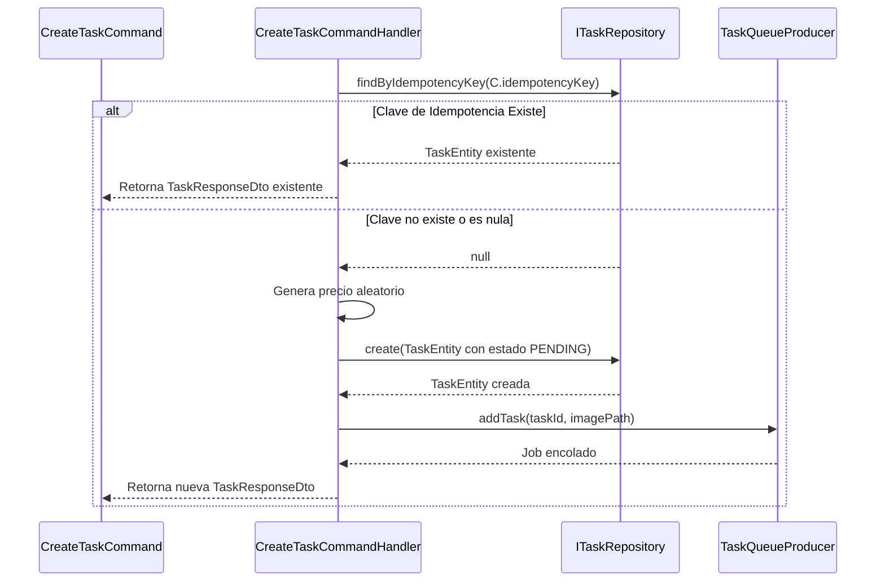
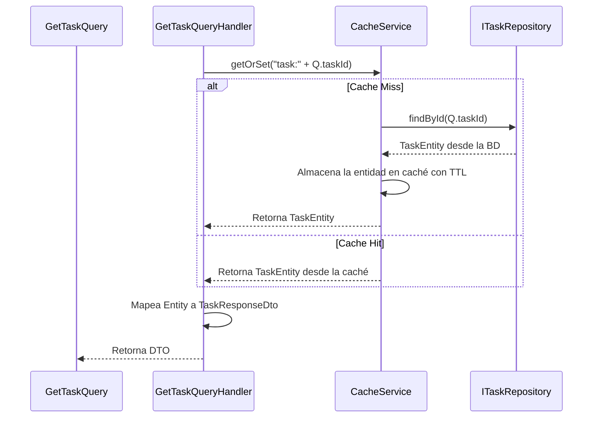
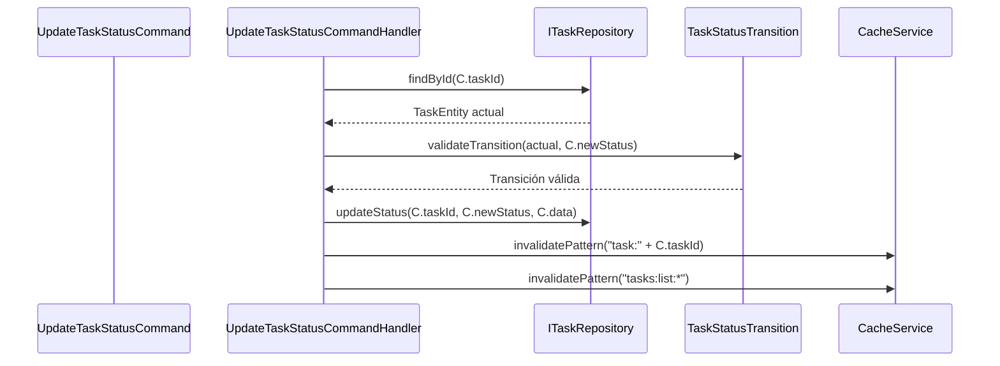
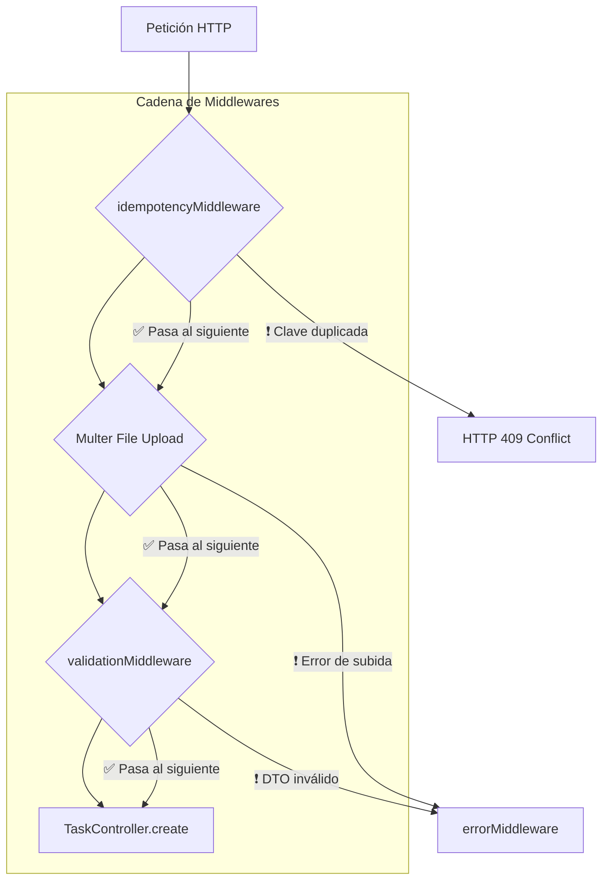
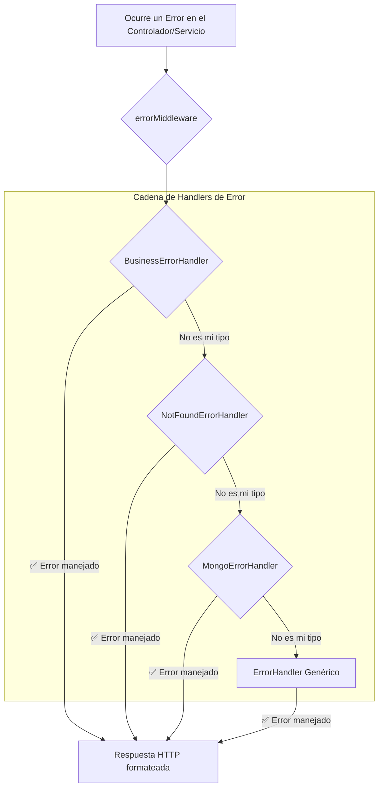

# 📚 Documentación Técnica Detallada

## Índice de Documentación

| Documento | Descripción |
|-----------|-------------|
| [`ARCHITECTURE.md`](ARCHITECTURE.md) | Visión general de la arquitectura híbrida del sistema. |
| [`EVENTS_FLOW.md`](EVENTS_FLOW.md) | Flujo detallado del sistema de eventos asíncronos. |
| [`PRESENTATION_APPLICATION_LAYERS.md`](PRESENTATION_APPLICATION_LAYERS.md) | Responsabilidades de las capas Presentation y Application. |
| [`DATABASE.md`](DATABASE.md) | Detalles sobre los esquemas, entidades e índices de MongoDB. |
| [`QUEUE_CACHE.md`](QUEUE_CACHE.md) | Detalles sobre el uso de BullMQ para colas y Redis para caché. |
| [`TESTING_DOCUMENTATION.md`](TESTING_DOCUMENTATION.md) | **Documentación completa de testing** - 335 tests con 70.84% coverage (+54.86% mejora). |

---

## ⚙️ Flujo Detallado de Handlers (CQRS)

Esta sección detalla la lógica interna de los `Handlers` clave del sistema, que se ejecutan en el flujo asíncrono.

### 1. `CreateTaskCommandHandler`

Este handler se encarga de la lógica de negocio para crear una tarea. Aunque el flujo HTTP síncrono utiliza `TaskService`, este handler contiene la lógica CQRS equivalente.

### 2. `GetTaskQueryHandler` (con Caché)

Este handler optimiza las lecturas utilizando una estrategia de caché "Cache-Aside".

### 3. `UpdateTaskStatusCommandHandler`

Este handler es invocado por el suscriptor de eventos para actualizar el estado de una tarea.

---

## ⛓️ Cadena de Responsabilidad en Middlewares

El sistema utiliza una serie de middlewares de Express que actúan como una Cadena de Responsabilidad. Cada middleware procesa la petición y, si todo es correcto, la pasa al siguiente, o de lo contrario, la corta y devuelve un error.

### Flujo de Middlewares para `POST /tasks`

---

##  errorHandler

La gestión de errores se centraliza en `errorMiddleware.ts`, que a su vez utiliza una Cadena de Responsabilidad para delegar el manejo a un `ErrorHandler` específico según el tipo de error.

### Flujo del `errorMiddleware`

-   **BusinessErrorHandler**: Maneja errores de lógica de negocio (`BusinessError`).
-   **NotFoundErrorHandler**: Maneja errores de recursos no encontrados (`NotFoundError`).
-   **MongoErrorHandler**: Maneja errores específicos de MongoDB (ej. claves duplicadas).
-   **ErrorHandler Genérico**: Captura cualquier otro error y devuelve una respuesta genérica 500.

---

## 🧠 Estrategia de Caché

La estrategia de caché se implementa siguiendo el patrón **Cache-Aside**, donde la aplicación es responsable de leer y escribir en la caché.

-   **Lectura (Queries)**: El `GetTaskQueryHandler` y `ListTasksQueryHandler` primero intentan obtener los datos de la caché a través del `CacheService`. Si no los encuentran (cache miss), los obtienen del repositorio (base de datos), los guardan en la caché para futuras peticiones y luego los devuelven.
-   **Escritura/Invalidación (Commands)**: Cuando un estado cambia (ej. `UpdateTaskStatusCommandHandler`), el handler no solo actualiza la base de datos, sino que también invalida activamente las entradas de caché relevantes. Utiliza `invalidatePattern` para eliminar claves específicas (como `task:ID`) y claves de listas (`tasks:list:*`) para asegurar que las próximas lecturas obtengan datos frescos.
-   **TTLs (Time-To-Live)**: Se asignan TTLs a las claves de caché para garantizar que los datos no se queden obsoletos indefinidamente, incluso si falla la invalidación explícita.
