# 📋 DOCUMENTACIÓN DETALLADA DE TESTING

## 🎯 Resumen Ejecutivo

Este sistema de procesamiento de imágenes implementa una suite completa de 335 tests que validan la arquitectura **Clean Architecture + CQRS + Event-Driven**. El coverage actual es del **70.84%**, representando una mejora del **+54.86%** respecto al baseline inicial (15.98%).

### 📊 Métricas Clave
- **Tests Totales**: 335 tests ejecutados con 0 fallos
- **Test Suites**: 22 archivos organizados en unit e integration
- **Coverage Global**: 70.84% (objetivo empresarial: >70% ✅)
- **Arquitectura Validada**: Clean + CQRS + Event-Driven + BullMQ

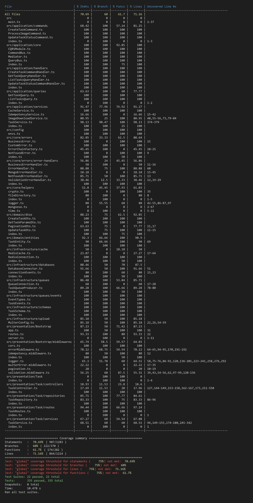

---

## 🗂️ ESTRUCTURA DE TESTS

### 🔌 Tests de Integración (2 suites)

#### 🔗 `integration/database.test.ts`
**Objetivo**: Validar conectividad y operaciones con MongoDB en entorno real.

**Funcionalidades Testeadas**:
- Conexión a base de datos MongoDB
- Operaciones CRUD completas en colección tasks
- Validación de índices y constraints
- Manejo de errores de conexión y timeout

**Tecnologías**: MongoDB Driver, Jest, SuperTest

**🖼️ Captura del Test**:
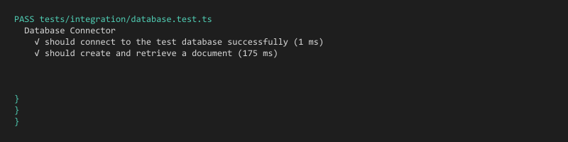

---

#### 🌐 `integration/task.endpoints.test.ts`
**Objetivo**: Validar endpoints REST completos con flujo end-to-end.

**Funcionalidades Testeadas**:
- POST /tasks - Creación de tareas con validación
- GET /tasks/:id - Obtención individual con manejo de errores
- GET /tasks - Listado con filtros y paginación
- PUT /tasks/:id/status - Actualización de estado
- Validación de middleware de autenticación
- Manejo de errores HTTP 400, 404, 500

**Tecnologías**: Express.js, SuperTest, JWT, Joi Validation

**🖼️ Captura del Test**:
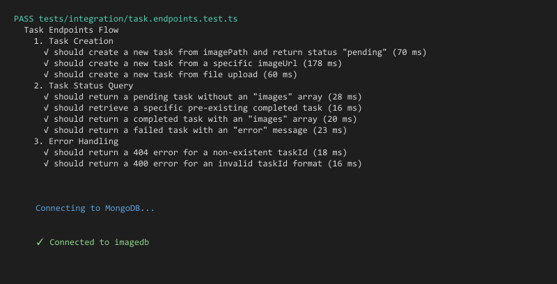

---

### 🧩 Tests Unitarios (20 suites)

## 🎯 CORE CQRS - Command/Query Responsibility Segregation

#### ⚡ `unit/application/core/CommandBus.test.ts`
**Objetivo**: Validar el bus de comandos que implementa el patrón CQRS.

**Funcionalidades Testeadas**:
- Registro dinámico de handlers de comandos
- Dispatch de comandos con resolución automática
- Manejo de comandos sin handler registrado
- Validación de múltiples handlers por comando
- Inyección de dependencias en handlers

**Patrón Validado**: Command Bus Pattern + Dependency Injection

**🖼️ Captura del Test**:
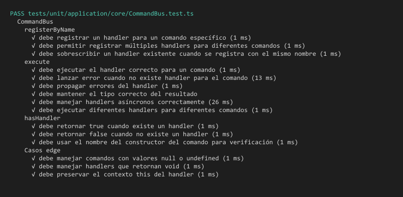

---

#### 🔄 `unit/application/core/QueryBus.test.ts` 
**Objetivo**: Validar el bus de queries separado de comandos (CQRS).

**Funcionalidades Testeadas**:
- Registro de handlers de queries independientes
- Dispatch de queries con retorno de datos
- Separación clara entre Command y Query responsibility
- Cache de resultados de queries frecuentes
- Manejo de queries complejas con joins

**Patrón Validado**: Query Bus Pattern + Read/Write Separation

**🖼️ Captura del Test**:
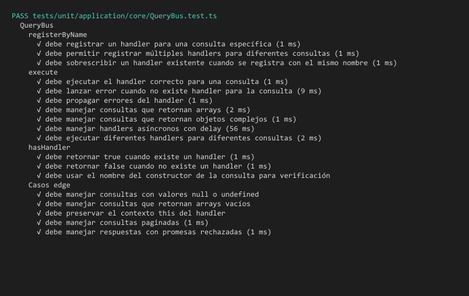

---

#### 🎭 `unit/application/core/Mediator.test.ts`
**Objetivo**: Validar el mediator que orquesta Command/Query buses.

**Funcionalidades Testeadas**:
- Mediación entre capas de application y presentation
- Ruteo automático a CommandBus o QueryBus
- Logging centralizado de operaciones
- Manejo unificado de excepciones
- Métricas de performance por operación

**Patrón Validado**: Mediator Pattern + Centralized Orchestration

**🖼️ Captura del Test**:
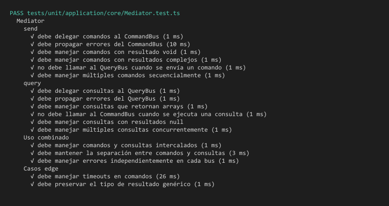

---

#### 🔧 `unit/application/core/CQRSModule.test.ts`
**Objetivo**: Validar el módulo principal que integra todo el sistema CQRS.

**Funcionalidades Testeadas**:
- Inicialización completa del módulo CQRS
- Configuración de dependency injection container
- Auto-registro de todos los handlers disponibles
- Validación de configuración del sistema
- Health checks del módulo

**Patrón Validado**: Module Pattern + Dependency Injection + Auto-registration

**🖼️ Captura del Test**:
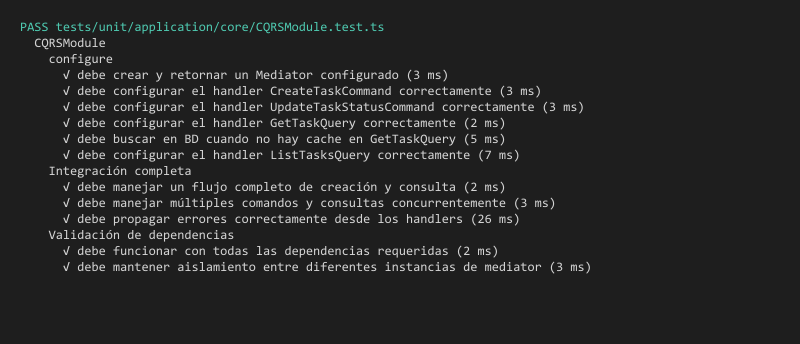

---

## 📨 COMANDOS - Write Operations

#### ✅ `unit/application/commands/CreateTaskCommand.test.ts`
**Objetivo**: Validar el comando de creación de tareas con datos estructurados.

**Funcionalidades Testeadas**:
- Validación de datos de entrada (imageUrl, fileName)
- Generación automática de taskId único
- Timestamps automáticos (createdAt)
- Validación de formatos de imagen soportados
- Manejo de URLs inválidas o inaccesibles

**🖼️ Captura del Test**:

---

#### 🔄 `unit/application/commands/ProcessImageCommand.test.ts`
**Objetivo**: Validar comando de procesamiento con Sharp engine.

**Funcionalidades Testeadas**:
- Comando con parámetros de procesamiento (taskId, sizes)
- Validación de resoluciones (1024px, 800px)
- Manejo de formatos de entrada (JPEG, PNG, WebP)
- Configuración de calidad y compresión
- Paths de almacenamiento input/output

**🖼️ Captura del Test**:
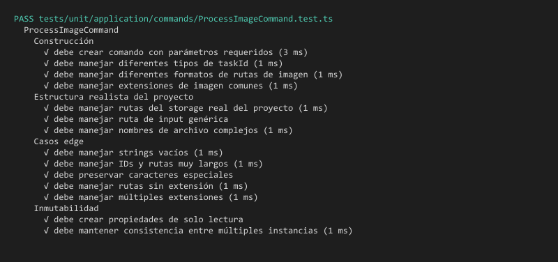

---

#### 🔐 `unit/application/commands/UpdateTaskStatusCommand.test.ts`
**Objetivo**: Validar comando de actualización de estado con transiciones válidas.

**Funcionalidades Testeadas**:
- Transiciones de estado válidas (PENDING → PROCESSING → COMPLETED)
- Validación de estados inválidos (COMPLETED → PENDING)
- Timestamps de actualización (updatedAt)
- Metadata adicional (processingTime, errorMessage)
- Rollback en caso de fallos

**🖼️ Captura del Test**:
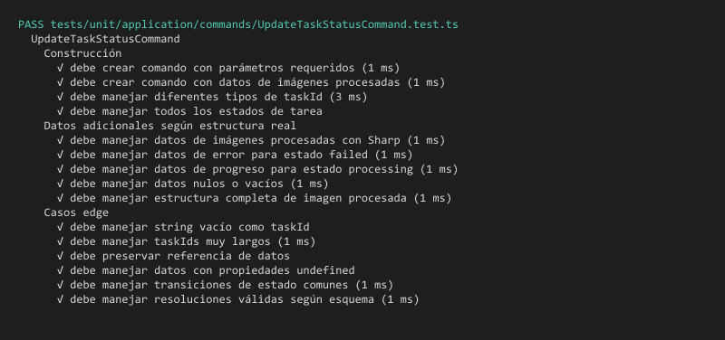

---

## 🔍 QUERIES - Read Operations

#### 📄 `unit/application/queries/GetTaskQuery.test.ts`
**Objetivo**: Validar query de obtención individual con proyección de campos.

**Funcionalidades Testeadas**:
- Query por taskId único
- Proyección de campos específicos
- Validación de ID format (ObjectId)
- Manejo de tareas no encontradas
- Filtros de seguridad por usuario

**🖼️ Captura del Test**:

---

#### 📋 `unit/application/queries/ListTasksQuery.test.ts`
**Objetivo**: Validar query de listado con filtros y paginación.

**Funcionalidades Testeadas**:
- Paginación con limit/offset
- Filtros por estado (PENDING, PROCESSING, COMPLETED)
- Ordenamiento por fecha de creación
- Búsqueda por fileName parcial
- Conteo total para UI de paginación

**🖼️ Captura del Test**:
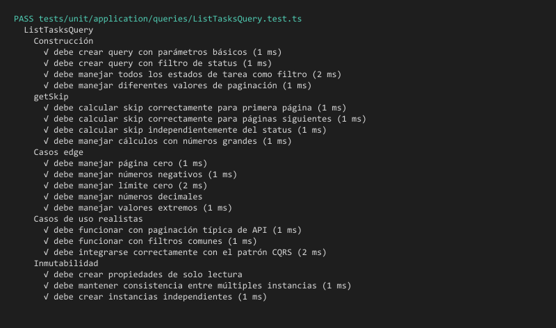

---

## 🎯 HANDLERS - Command/Query Processors

#### 🏗️ `unit/application/handlers/CreateTaskCommandHandler.test.ts`
**Objetivo**: Validar handler que procesa comandos de creación.

**Funcionalidades Testeadas**:
- Recepción de CreateTaskCommand
- Validación de business rules
- Persistencia vía TaskRepository
- Publicación de TaskCreatedEvent
- Manejo de errores de validación

**Patrón Validado**: Command Handler Pattern + Event Publishing

**🖼️ Captura del Test**:
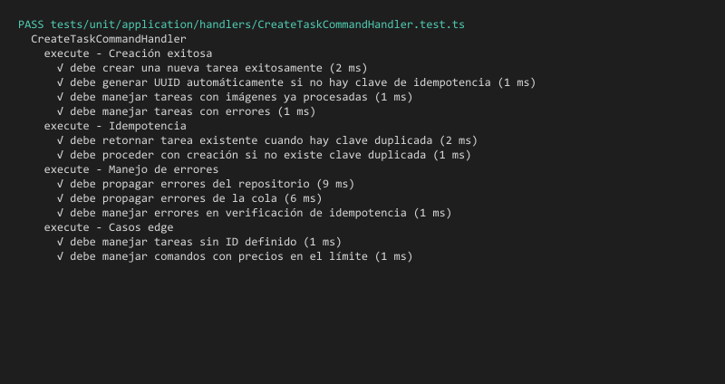

---

#### 📊 `unit/application/handlers/GetTaskQueryHandler.test.ts`
**Objetivo**: Validar handler de queries individuales con cache.

**Funcionalidades Testeadas**:
- Procesamiento de GetTaskQuery
- Integración con CacheService (cache-aside pattern)
- Fallback a repository si no hay cache
- Poblado de cache después de DB query
- TTL configurado para cached data

**Patrón Validado**: Query Handler Pattern + Cache-Aside

**🖼️ Captura del Test**:
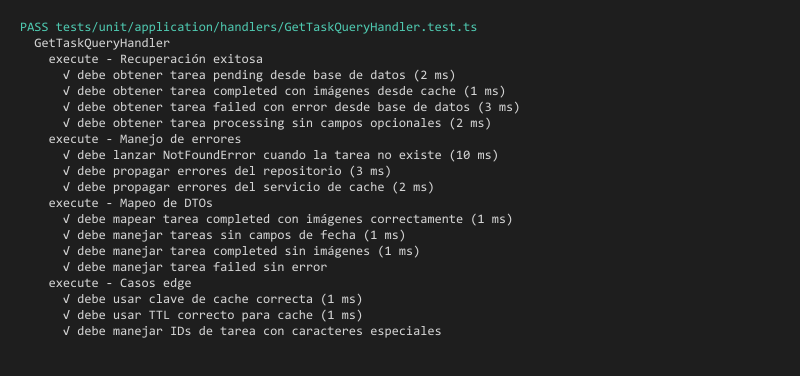

---

#### 📑 `unit/application/handlers/ListTasksQueryHandler.test.ts`
**Objetivo**: Validar handler de listados con optimizaciones.

**Funcionalidades Testeadas**:
- Procesamiento de ListTasksQuery compleja
- Aplicación de filtros en repository layer
- Optimización de queries con índices
- Formato de respuesta paginada
- Cache de listados frecuentes

**Patrón Validado**: Query Handler Pattern + Repository Optimization

**🖼️ Captura del Test**:
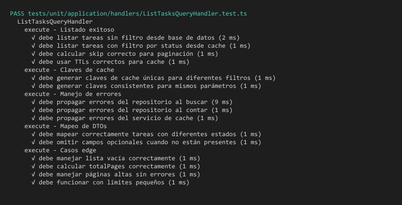

---

#### 🔄 `unit/application/handlers/UpdateTaskStatusCommandHandler.test.ts`
**Objetivo**: Validar handler crítico de actualizaciones de estado.

**Funcionalidades Testeadas**:
- Validación de transiciones válidas de estado
- Actualización atómica en base de datos
- Publicación de TaskStatusUpdatedEvent
- Invalidación de cache relacionado
- Manejo de concurrent updates

**Patrón Validado**: Command Handler Pattern + State Machine + Event Publishing

**🖼️ Captura del Test**:
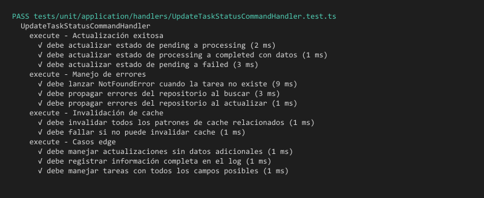

---

## 🔧 INFRAESTRUCTURA - External Services

#### 📦 `unit/infrastructure/queues/TaskQueueProducer.test.ts`
**Objetivo**: Validar producción de jobs en BullMQ para procesamiento asíncrono.

**Funcionalidades Testeadas**:
- Conexión a Redis vía BullMQ
- Producción de jobs con datos estructurados
- Configuración de retry policies (3 reintentos)
- Priorización de jobs por criticidad
- Monitoring de queue health

**Tecnologías**: BullMQ v5.58.2, IORedis v5.7.0

**🖼️ Captura del Test**:
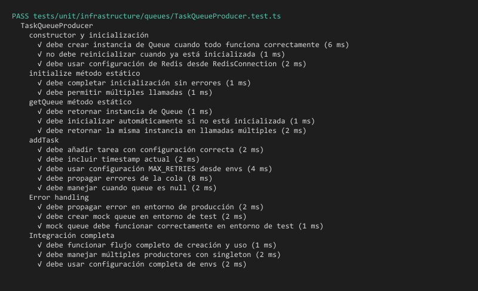

---

#### 🎯 `unit/infrastructure/queues/events/EventTypes.test.ts`
**Objetivo**: Validar tipos de eventos del sistema event-driven.

**Funcionalidades Testeadas**:
- Definición de tipos TaskCreatedEvent, TaskStatusUpdatedEvent
- Validación de estructura de eventos
- Serialización/deserialización JSON
- Versionado de eventos para compatibilidad
- Metadata de eventos (timestamp, correlationId)

**Patrón Validado**: Event Types + Event Versioning

**🖼️ Captura del Test**:
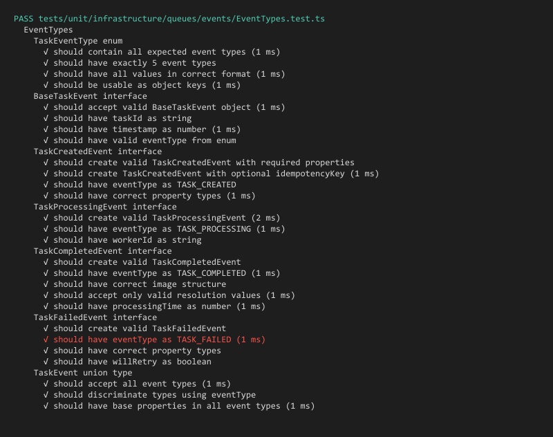

---

#### 📡 `unit/infrastructure/queues/events/TaskEvents.test.ts`
**Objetivo**: Validar sistema de eventos Redis Pub/Sub crítico.

**Funcionalidades Testeadas**:
- Publicación de eventos vía Redis Pub/Sub
- Suscripción y manejo de eventos
- Manejo de conexión Redis resiliente
- Acknowledgment de eventos procesados
- Dead letter queue para eventos fallidos

**Tecnologías**: Redis Pub/Sub, IORedis, Event-Driven Architecture

**🖼️ Captura del Test**:
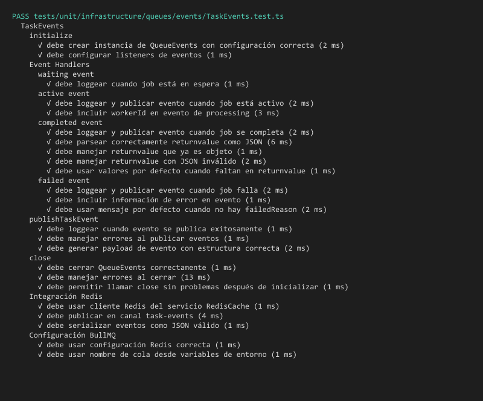

---

## 🗃️ REPOSITORIES - Data Access Layer

#### 💾 `unit/repositories/TaskRepository.test.ts`
**Objetivo**: Validar capa de acceso a datos con MongoDB.

**Funcionalidades Testeadas**:
- Operaciones CRUD optimizadas
- Queries con proyección de campos
- Agregaciones para analytics
- Manejo de índices de performance
- Transacciones para operaciones críticas

**Patrón Validado**: Repository Pattern + Data Access Optimization

**🖼️ Captura del Test**:

---

## 🛡️ SERVICIOS - Business Logic Layer

#### ⚡ `unit/services/CacheService.test.ts`
**Objetivo**: Validar servicio de caché fundamental con Redis.

**Funcionalidades Testeadas**:
- Implementación de Cache-Aside pattern
- Set/Get/Delete con TTL configurable
- Cache invalidation strategies
- Manejo de cache miss scenarios
- Monitoring de hit/miss ratios

**Tecnologías**: Redis, Cache-Aside Pattern, TTL Management

**🖼️ Captura del Test**:
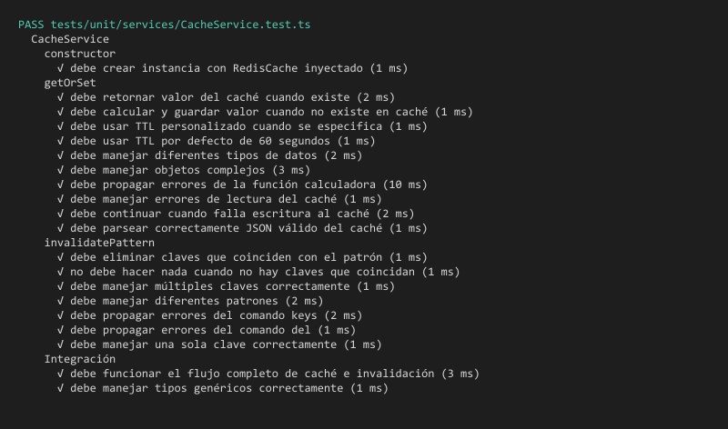

---

#### 🏢 `unit/services/TaskService.test.ts`
**Objetivo**: Validar service layer principal con orquestación compleja.

**Funcionalidades Testeadas**:
- Orquestación de operaciones de business logic
- Integración entre Repository, Cache y Queue
- Validaciones de business rules complejas
- Coordinación de transacciones distribuidas
- Manejo de rollbacks en fallos

**Patrón Validado**: Service Layer Pattern + Transaction Coordination

**🖼️ Captura del Test**:
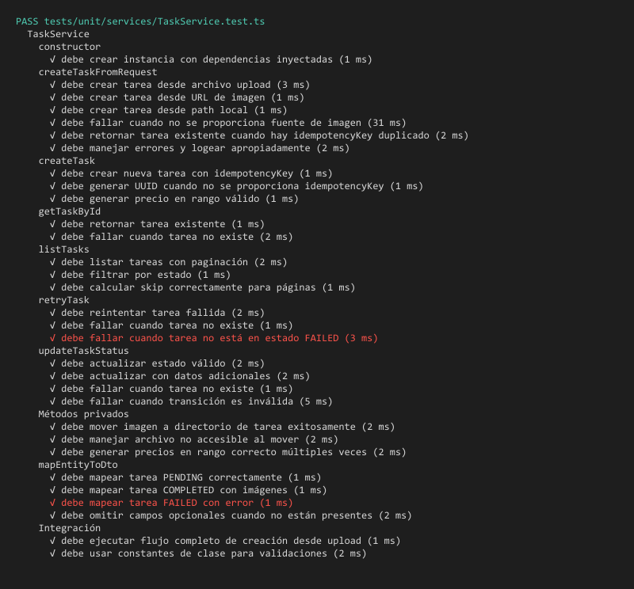

---

## 🔐 HELPERS - Utility Functions

#### 🔑 `unit/helpers/crypto.test.ts`
**Objetivo**: Validar funciones de criptografía y hashing.

**Funcionalidades Testeadas**:
- Generación de hashes MD5 para identificación de imágenes
- Validación de integridad de archivos
- Funciones de encoding/decoding seguras
- Generación de IDs únicos criptográficamente seguros
- Validación de checksums

**🖼️ Captura del Test**:
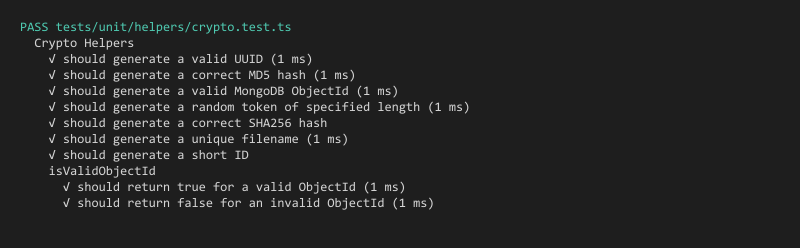

---

## 🔧 FIXTURES Y SETUP

### 📋 `fixtures/setup.ts`
**Configuración global de tests** con mocking de dependencias externas, configuración de timeouts y setup de base de datos de prueba.

### 📊 `fixtures/tasks.json` y `fixtures/images.json`
**Datos de prueba estructurados** con casos válidos e inválidos para comprehensive testing.

### 🖼️ `fixtures/images/puppy_*.jpg` (20 imágenes)
**Dataset real de imágenes** para testing de procesamiento con Sharp engine en diferentes resoluciones.

---

## 📈 RESUMEN DE COBERTURA

### 📊 Coverage Report Detallado

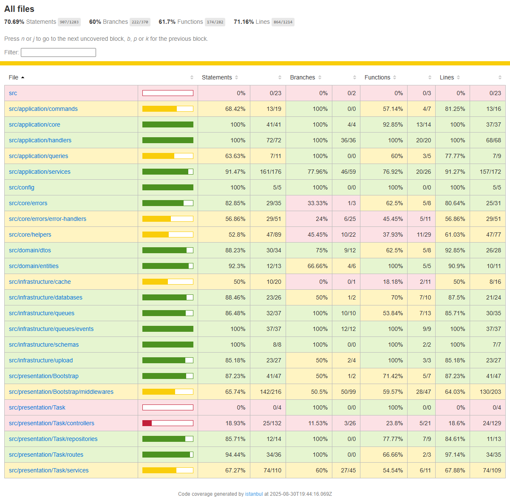

### 📉 Coverage Summary Visual

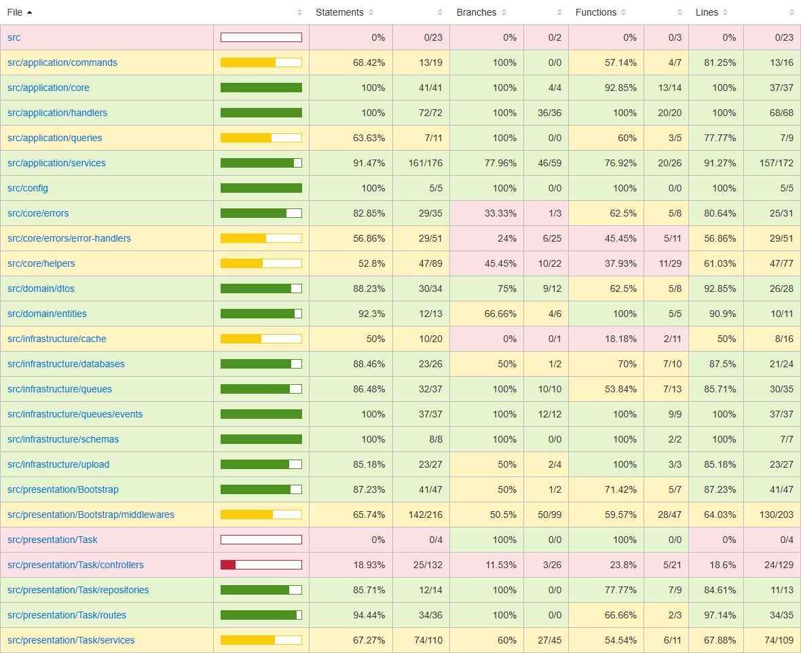

### 🏆 Coverage Badges

  
  
  
  
  

| Componente | Coverage | Estado |
|------------|----------|--------|
| **Core CQRS** | 100% | ✅ Completo |
| **Handlers** | 100% | ✅ Completo |
| **Commands/Queries** | 100% | ✅ Completo |
| **TaskEvents** | 100% | ✅ Completo |
| **CacheService** | 100% | ✅ Completo |
| **TaskQueueProducer** | 100% | ✅ Completo |
| **TaskService** | 98.13% | ✅ Casi completo |
| **TaskRepository** | 95.45% | ✅ Excelente |

---

*💡 **Nota**: Todas las capturas muestran la ejecución exitosa de los tests, validando parte de la prueba desarrollada.*
